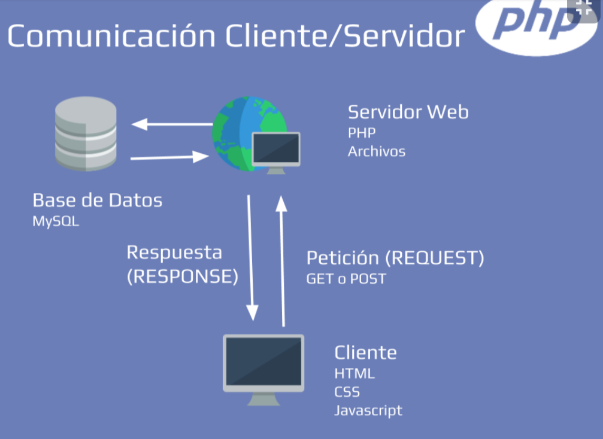
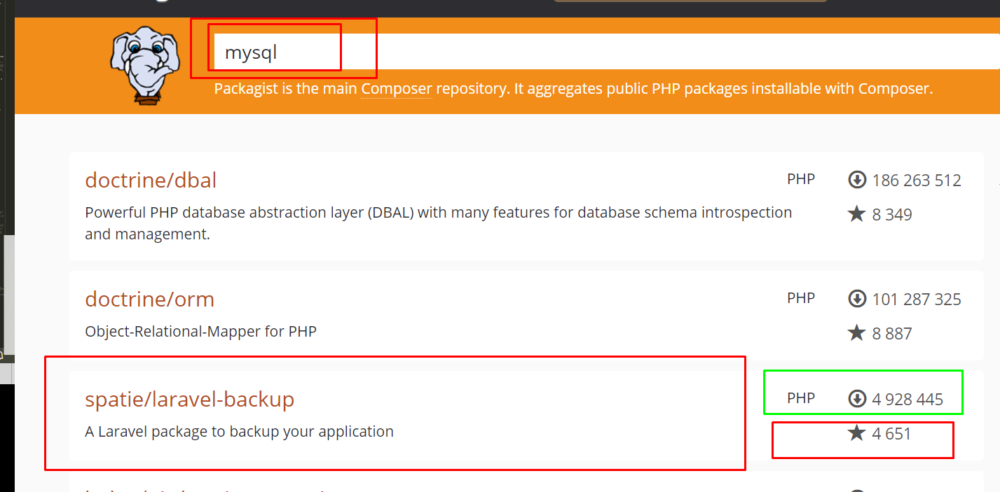

# Introducción Composer con PHP

## Qué aprenderás sobre PHP con Composer

- PHP es un lenguaje de programación que funciona en la web

- Cada lenguaje de programación mantiene sus propias reglas, a estas reglas se les llama sintaxis.

## ¿Como funciona la web?

- Petición: El usuario realiza una acción sobre una página web, lo cual se lanza una petición y es enviada al servidor.
- Procesamiento: Esa petición enviada es procesada por el servidor
- Respuesta: El servidor prepara la respuesta y es enviada de vuelta al usuario.


## Herramientas para seguir el curso

> PHP es un lenguaje del lado del servidor, para desarrollar aquí debemos convertir a nuestro equipo en un servidor web sin importar el método o la manera de lograrlo, por ello lo explico de forma sencilla precisamente para enfocarnos netamente en la programación web y no en el sistema de servidores. Para ello debemos contar con los servicios necesarios lo que nos permitirá seguir con éxito el curso.

- Usare Laragon -> Para tener el ambiente de servidor APache 

- XAMPP Listo ✅
- Composer instalado✅
- Git Instalado✅
- [Laragon](https://laragon.org/download/index.html)  ✅

## Ser programador

> Un programador entiende y manipula un lenguaje de programación para crear soluciones que realmente sean útiles para la humanidad.

-  El arte de programar: En esencia un programador es un artista y expresa su arte a través de lineas de código.


## El mundo del desarrollo web

> El mundo del desarrollo web funciona en una arquitectura cliente-servidor, en donde un cliente envía una petición hacía un servidor, en ese servidor se encuentra instalado PHP y a su vez una base de datos.

> Como desarrollares web necesitamos conocer conceptos de frontend como HTML, CSS y JavaScript para saber en detalle lo que estamos haciendo al momento de desarrollar.



## Introducción a PHP

- La Sintaxis: Es la forma adecuada de escribir algo, para que otra cosa lo entienda.
- La palabra reservada protected en PHP, permite que la variable sea protegida otorgándole un nivel de seguridad. ``` protected $name = Brayan"; ```
- Podemos omitir automaticamente la etiqueta cierre cuando el documento es puro php. 
- PHP nos píde que finalicemos nuestras líneas de código con ’;' para saber que una sentencia termino.
- forma de comentar // --- /**/
- **echo** para ver el resultado en pantaña 


## Sintaxis básica de PHP: asignación y aritmética

PHP es un lenguaje con tipos de datos “dinámicos”, por lo cual, a diferencia de otros lenguajes más estrictos, no requiere que especifiques el tipo de dato que almacenará la variable, cuando le asignas una valor a la variable, PHP automáticamente reconocerá el tipo de dato que está almacenado.

En programación existen diferentes tipos de datos usados para diferentes tipos de tareas o necesidades, los tipos más básicos y comunes en cualquier lenguaje de programación son:


- String (Texto o cadenas de caracteres).
- Integer (Números enteros).
- Float (Números con punto decimal).
- Boolean (Verdadero o falso).
- Null (Ausencia de valor).
- Array (Cadena o colección de varios valores).

```
<?php

    //Asignación

    $num = 9;
    $lang = [
        'es' => 'español',
        'en' => 'inglés'
    ];

    //Aritmética

    echo "Suma 2 + 2 " . ((int) 2 + (int) 2);
    echo "Resta 2 - 2 " . ((int) 2 - (int) 2);
    echo "Multiplica 2 * 2 " . 2*2;
    echo "Divide 2 / 2 " . 2 / 2;
    echo "Módulo 2 % 2 " . 2 % 2;
    echo "Exponencial 2 ** 2 " . 2 ** 2;
    
?>
```

## Sintaxis básica de PHP: comparación y variables

### ¿Qué es una variable?
En sencillas palabras, una variable es una parte de código que te permite guardar un dato. Un ejemplo puede ser una caja, en donde dentro de ellas guardamos cosas. La caja es la variable contenedora que tiene al objeto y las cosas que guardamos son los datos.

- echo $$app;
> Eso quiere decir que… ¿El nombre de mi variable es $app? ¡Sí! El nombre de tu variable es $app, pero un momento, $app también tiene un signo de dólar… ¡$app también es una variable! entonces, PHP trata de resolver ese valor, ¿Cuál es el valor de $app? El valor de $app es “name” por tanto, en la expresión “echo $$app;” PHP reemplaza “$app” por “name” (que es su valor), y entonces, la epresión queda como “echo $name;” recuerda, $app fue sustituido por el valor de su variable, ¡Y ahora si! Ya tenemos la variable que queríamos, le estamos pidiendo a PHP que me imprima el valor de $name, ¿Y cuál es el valor de $name? ¡El valor de $name es “platzi”!  Así es como funcionan las variables variables en PHP, espero le pueda ser de ayuda a alguien ❤️


### ¿Notaste que había dos tipos de comillas entre las variables?

- Las comillas simples (' ') se interpretan como texto plano. Como por ejemplo, el nombre agregado en la variable $nombre.
- Las comillas dobles (" ") intentan interpretar todo lo que encuentre dentro.

```
//Variables variables
    $app = 'name';
    $name = 'platzi';

echo $app; // Nos imprime: name
echo $$app; // Nos imprime: platzi

```

### ¿Cómo creo una variable?
El proceso de creación de una variable tiene 2 partes:

- Declaración
- Asignación

## Bloques de códigos sencillos en PHP

Los sistemas  corren de arriba hacia abajo, por lo que tu códgo debes leerlo de esa manera para lograr entender el funcionamiento 

> Condición: Digamos que se desea validar si una persona es mayor de edad (Mayor a 18 años)

```
if ($edad >= 18) {
    echo "ES MAYOR DE EDAD";
} else {
    echo "ES MENOR DE EDAD";
}
```

> Switch: Digamos que tenemos Opción 1,2 o 3 en vez de hacer un if por cada opción hacemos:

```
switch ($opcionEscogida) {
    case 1:
        echo "ELIGIÓ LA OPCIÓN 1";
        break;
    
    case 2:
        echo "ELIGIÓ LA OPCIÓN 2";
        break;

    case 3:
        echo "ELIGIÓ LA OPCIÓN 3";
        break;
    
    default:
        echo "ELIGIÓ UNA OPCIÓN DIFERENTE";
        break;
}
```

> For: Se utiliza este ciclo si sabemos exactamente cuántas repeticiones necesitamos, por ejemplo los números del 1 al 5:
```
for ($i=1; $i < 6; $i++) { 
    echo $i
}

foreach($row as $filas){
    # code ...
}

// RESULTADO: 12345
``` 

> While: Si no conocemos cuántas repeticiones usamos este ciclo:
``` 
while ($opcion != 0) {
    echo "ESTE CICLO NO ACABA HASTA QUE Opcion sea diferente a 0";
}
``` 

> Do While: Si no conocemos el total y si necesitamos que entre al menos una vez
```
do{

    echo "ESTE CICLO NO ACABA HASTA QUE Opcion sea diferente a 0";
} while ($opcion != 0) 
``` 


> Extra: if simplificado Podemos hacer un if sencillo en una sola línea de la siguiente manera:
``` 
// Condición ? Si es Verdadero : Si es Falso ;
echo true ? "CUMPLE LA CONDICIÓN" : "NO CUMPLE LA CONDICIÓN";
``` 

## Composer

> Composer es una herramienta que profesionalizo la forma en la que trabajamos en PHP, es esa herramienta que instalamos en nuestro proyecto que nos ayuda a gestionar los paquetes que utilizaremos en el mismo.

> 🐘 Composer es un gestor de dependencias que nos permite gestionar librerías de toda la comunidad de PHP

> Composer no es un administrador de paquetes en el mismo sentido que Yum o Apt. Sí, se ocupa de “paquetes” o bibliotecas, pero los gestiona por proyecto, instalándolos en un directorio (por ejemplo vendor) dentro de su proyecto. De forma predeterminada, no instala nada globalmente.

> El psr-4 es un estándar que básicamente maneja los nombres de espacio de un código haciendo alusión a la ruta en la que se encuentran. Los nombres de espacio son, en resumen, como el apellido de nuestras clases, por ejemplo, puedo tener dos clases llamadas “Format”, pero puedo tener una en nombres de espacios diferentes, y usar ambas en el mismo código, de esa manera, PHP sabe cuál de las dos clases quieres usar.

> Una vez que termina de descargar los paquetes los coloca dentro de una carpeta llamada vendor que está definida en nuestro archivo composer.json. Composer es capaz de instalar los paquetes que necesitas para tu proyecto con las versiones que necesites y además se encarga de todas las dependencias que se necesiten, quitándonos el dolor de tener que hacer esto manualmente y mantenerlo todo actualizado. NO DEBES TOCAR NADA QUE ESTÉ EN VENDOR.

``` 
{
    "name": "devitm/paquete-desarrollado",
    "description": "un pequeño aporte para alumnos de Platzi con mucho amor <3",
    "authors": [
        {
            "name": "Marco Aspeitia",
            "email": "contacto@devitm.com"
        }
    ],
    "require": {
        "php": ">=5.5.0"
    },
    "autoload": {
        "psr-4": {
            "SumaDosNumeros\\": "src/"
        },
        "files": [
            "src/helpers.php"
        ]
    }
}

``` 

### Como usamos la terminal

- ```> composer dump``` -> genera lo configuración basica de composer 


## Gestión de paquetes PHP


Utilizar Composer nos garantiza que la gestión de dependencias de paquetes se haga correctamente.

Para buscar librerías o paquetes de PHP podemos ir a Packagist y ver los comandos que necesito para descargarlos a mis workstage.

Para crear los archivos que necesita composer para nuestro proyecto podemos poner este comando y composer se encargará de crearlo por nosotros

> Composer nos permite manejar las dependencias de PHP. 

> Packagist: es nuestro buscador donde si nosotros queremos trabajar con correos electronicos, o alguna otro aditamento simplemente escribimos email, slider, json, base de datos y vamos a descargar el que tenga mejores estadisticas, ahí nos va a decir el comando con el cuál lo podemos de descargar a través de la terminal.

composer require --dev phpunit/phpunit

- [Link de Packagist](https://packagist.org/)
- [Como instalar Composer](https://www.youtube.com/watch?v=HBDJsc2cXR4)
- [Composer Pagina oficial ](https://getcomposer.org/)




## Instalar Composer en UNIX 


Para aquellos que tienen problemas con la instalación de “composer require --dev phpunit/phpunit” les proporciono la siguiente liga:

Habilitar extensiones php

En resumen la solución es la siguiente:
```
sudo apt-get install -y php7.4-gd

sudo apt-get install php7.4-intl

sudo apt-get install php7.4-xsl

udo apt-get install php7.4-mbstring
```
> Nota: cambiar tu version de php si aplica el caso 


## Cómo iniciar un proyecto

Al igual que la mayoría de gestores de paquetes, Composer también tiene un comando especial para empezar un proyecto con y que este pueda descargar las dependencias que necesitamos de una vez.

``` composer init ```
Para instalar las dependencias recuerda utilizar el comando:

``` composer install ```

I'm  Developer  PHP