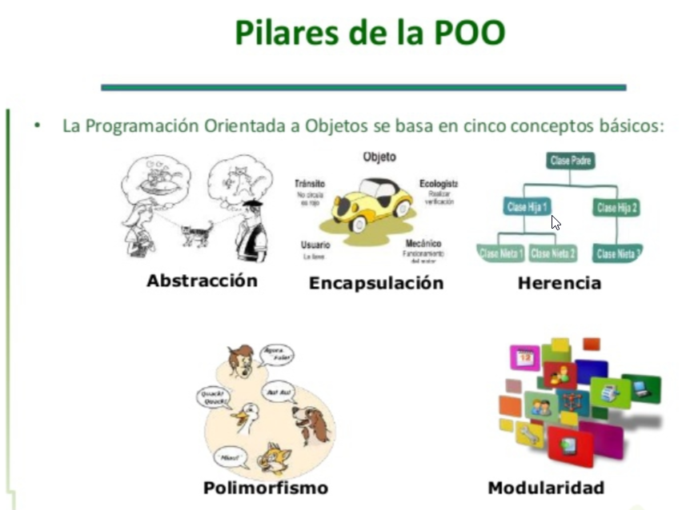

# Curso ProgramacionOrientadaObjetosPHP

> La OOP (Object-oriented programming) son una paradigma compuesto por técnicas que nos ayudará a hacer menos líneas de código y que este sea más reutilizable.

**Estos serían los pasos que debemos seguir para tener una OOP:**

- Crear la clase, esta se trata de un molde para crear objetos.
- Crear una instancia, el objeto es la instancia de la clase.

```
<?php

class User {
    public $type;
}

class Admin {
    public function greet() {
        return "Hola admin";
    }
}

$user = new User;
$user->type = new Admin;
echo $user->type->greet();
```


## Deuda técnica
> La deuda técnica es el coste y los intereses a pagar por hacer mal las cosas. 
> Esto paso por que como programadores queremos programar algo rápido hoy y que funcione, pero a futuro cuando volvamos a nuestro código nos daremos cuenta que no es difícil de modificar.


** Cómo evitar la deuda técnica **
- Tenemos que programar con pruebas.
- Documentar a tiempo
- Refactorizar (mejorar) de inmediato nuestro código.


### Code smell

> Hace referencia al mal olor del código. 
> Este concepto no se refiere a errores técnicos, sino a errores de orden y diseño. 
> Esto sucede mucho cuando intentamos crear soluciones a partir de otras soluciones.

**La solución a estos casos es crear una abstracción**

**Cómo evitarlo**
- Para esto debemos hacer una programación más limpia, y reusable. 
- Tenemos que evitar crear grandes métodos, o sea, programación estructura dentro de clases. 
- También evitar crear grandes clases o superclases.
- Y sin duda, nosotros debemos evitar a toda costa copiar y pegar código.
- 🙃 Recuerda: el sistema va a funcionar pero a futuro va a ser horrible de mantener, hasta imposible. 


## Código espagueti

- Un código espagueti es código que está estructurado mediante if, while, for netamente, todo en un mismo archivo donde solamente buscamos resolver el problema. 
- Cuando creamos código estructurado corremos peligro de crear código espagueti. 
- La OOP nos ayuda evitarlo.
- 💸 El dinero en esta profesión está en el mantenimiento del código.

**Cómo evitar el código espagueti**
- Resolver el problema
- Crea de forma lógica y coherente diferentes métodos que reemplacen tus estructuras de control.
- Crea una o varias clases dependiendo el caso.


## Inclusión de archivos

> Es una técnica que nos permite incorporar archivos a nustro código principal, podemos crear una solución única, qué se podrá usar durante todo el proyecto. 

**Existen varias maneras de incorporar archivos a nuestro codigo. **

- include'<ruta>': Como la palabra lo dice, incluye un archivo dentro de otro. Cuando el archivo no es encontrado o tiene algún error, el sistema lanzara un warning pero seguirá trabajando

- require ('<ruta>'): Funciona igual que include la única diferencia es que este arrojara un fatal error a nivel de compilación y todo el sistema dejara de funcionar hasta que se solucione el problema.

- requiere_once ('<ruta>'): Funciona igual que requiere excepto que PHP verificará si el archivo ya ha sido incluido y si es así, no se incluye (require) de nuevo.

- include_once '<ruta>': Tiene un comportamiento similar al de la sentencia include, siendo la única diferencia de que si el código del fichero ya ha sido incluido, no se volverá a incluir, e include_once devolverá TRUE. Como su nombre indica, el fichero será incluido solamente una vez.

> Nota: Esto permite entender como aislar la estructura es deci nuestro bloques de código, No es programación POO, pero nos genera una pequeña base para entender los conceptos avanzados.  


## Introducción a clases y objetos

La clase es el molde con el cual crearemos nuestros objetos. Para crear una clase y después un objeto lo hacemos así:

**¿Qué es la Poo?**

La Poo es una paradigma que nos permite mapear objetos reales al mundo digital. 🚀

**🤔¿Qué es una clase?**

Una clase es una un “Molde” para crear objetos, la cual esta compuesta por atributos y métodos. 😯

**🔳¿Qué es un objeto?**

Son entidades que tienen un determinado estado, comportamiento e identidad.😎
Es el resultado de la instancia de una clase.

**😧¿A que se refieren con instancia?**

Se refiere a la actividad de crear un objeto mediante la lectura, recuperación de los atributos de una clase.🤩


## Abstracción

Es básicamente lo que nos ayuda a abstraer, a pensar en el resultado final antes de que vayamos a la programación.

En este momento estamos declarando en la interfaz lo que queremos.

```
<?php

interface StoreInterface {
    public function get();
}
```

Las interfaces serán contratos que indicarán que es lo que se debe de hacer sin proveer ninguna funcionalidad.

Se acostumbra que los archivos que contengan al final la palabra interface.

Para implementar una interfaz en una clase ponemos la palabra reservada implements después del nombre de la clase.


```
<?php

require_once './store_interface';

class Database implements StoreInterface {
    public function get() {
        # code...
    }
}
```

Las clases abstractas cuando tienen métodos define lo que tienen qué hacer pero no cómo se debe de hacer. Estas clases pueden ser heredadas por X clases que necesitemos pero no pueden ser instanciadas.

Un método abstracto solo se define, no se declara

```
<?php

abstract class Base {
    public function get() {
        # code...
    }

    abstract public function store();
}
```

Y para implementar una clase abstracta ponemos:


```
<?php

require_once './base.php';

class Cached extends Base
{
    public function store() {
        # code...
    }

}
```

💡 El nivel de abstracción determina en ocasiones la calidad de solución a un problema. 

> Las interfaces se hacen para que clases puedan heredar de ellas extendiendo (o con implements). Los metodos que hay en la interfaz son obligatorios para la clase y deben ser definidos en esta. Lo “curioso” es que en la interfaz solo se declara el método, pero no se le dá más lógica, eso se hará en la clase. Todos los métodos en las interfaces tienen que ser públicos.
> Para mí falta algo importante sobre “Abstract class” y es que tengo entendido que este tipo de clases no se pueden instanciar, no se pueden generar objetos a partir de ellas; sólo se pueden tomar como modelos para las herencias.

##Enlace 
https://www.youtube.com/watch?v=Id3kTuEPB_s&ab_channel=codigofacilito 

## Resumen 

> La programación orientada a objetos es una forma de programar, un paradigma o una técnica. Los conceptos que aquí aprendiste te servirán en PHP y en otros lenguajes de programación. Recordemos que para programar de esta forma en realidad debemos crear objetos, y un objeto es una instancia de una clase y una clase es el molde. Ejemplo:

- Programación orientada a objetos: es la técnica.
- PHP: es el lenguaje de programación (donde implementamos la técnica).

## Podemos resumir los diferentes conceptos de la siguiente manera:

- Herencia: compartir métodos entre clases padres y clases hijas.
- Abstracción: significa aislar, separar y sacar.
- Polimorfismo: capacidad o virtud que tienen los métodos donde, por ejemplo, un mismo método puede tener diferentes comportamientos y dar diferentes resultados.
- Modularidad: este principio básicamente nos ayuda a tener cada vez piezas de código más pequeñas y entendibles, donde cada pieza es un módulo y muchos módulos forman el sistema entero.
- Encapsulamiento: un objeto debe estar aislado y ser un módulo natural. Esto se cumple aplicando la protección a las propiedades impidiendo su modificación y básicamente se refiere a controlar el acceso.

> Al entender este estilo conseguimos organizar mucho mejor nuestro código agrupando tareas comunes para crear una sola solución y usarla las veces que sean necesarias en nuestro proyecto. Evitamos con esto repetir código y ganamos mucho al dar mantenimiento en el futuro.

- Comienza con la palabra reservada class.
- El código va entre llaves { }.
- La información se guarda en propiedades que pueden ser públicas, privadas o protegidas.
- Cada acción la colocamos en métodos que básicamente son funciones o bloques de código dentro de una clase.
- $this es una variable reservada por el lenguaje que podemos usar para acceder a elementos propios, siempre y cuando estemos en la instancia de la clase.
- new es la palabra clave usada para crear un objeto a partir de una clase.




Bikatti