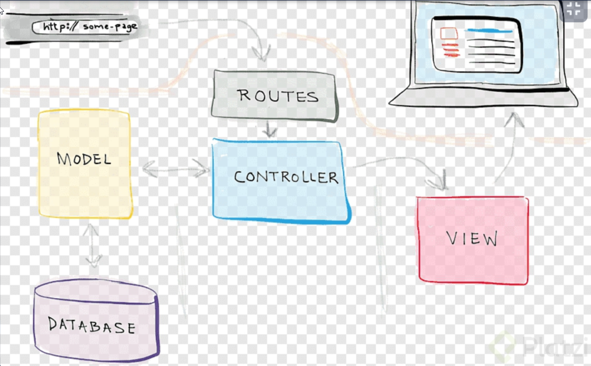
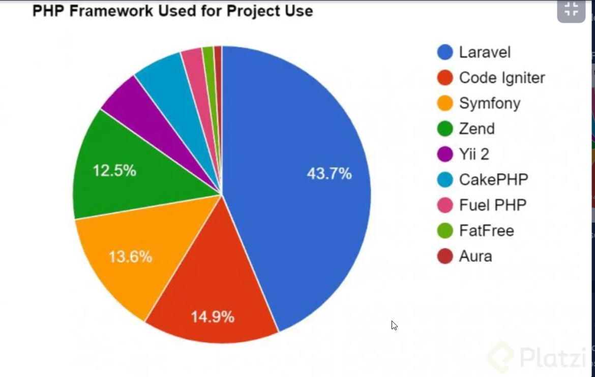

# Frameworks PHP

## Los frameworks como Symfony y Laravel para PHP, sus características notables son:

- Administración de plantillas.
- Manejo fácil y sencillo de una conexión a una DB.
- Funciones pre-hechas.
- Sistema de testing.
- Testing Cache.
- Maneja un estándar para la creación de archivos y carpetas.
- Utilizar frameworks habla de mi dominio del lenguaje y de mis buenas prácticas de escritura de código.

## Estructura de carpetas

> Es la forma que manejamos nuestros desarrollo en un framework es algo muy importante al momento de generar proyectos.

Ejemplo 

## Front Controller

- Es un patrón que nos ayuda a solucionar el problema de acceso único en la web. 
- Este se utiliza para proporcionar un mecanismo centralizado para manejar solicitudes, todas las solicitudes son procesadas por un solo controlador. 
- El controlador puede realizar la autenticación / autorización / registro o solicitud de seguimiento, entonces la petición al controlador adecuado.
- En este caso, vamos a lograr que todos pase a través de index.php, así centralizaremos los accesos. 
- Además, ya no necesitaremos tener un sistema lleno de include para incluir cabeceras o footers.

- 📁 Cuando nos referimos a rutas absolutas quiere decir que la ruta comienza en la raíz del directorio.
- Esto es todo lo que contendrá el archivo index. 
- Este va a cargar todo lo necesario, luego va a disponer de la clase Request porque lo registramos en composer, este va a ejecutar el método enviar.

> Resumen: Básicamente es centralizar todas las peticiones.

- Un controlador, como su nombre lo dice, es una clase que se encarga de hacer todo el procesamiento del request del usuario, ahí es en donde en la mayoría de las veces ejecutaremos la lógica, y por su puesto, se retorna el resultado, en este caso, una vista.
- Como se retorna una instancia de Response, entonces tenemos acceso a todos los datos de la vista que mandamos desde la misma clase.
- Esta es una forma de programación mucho más limpia y ordenada, siempre me gustó trabajar así

## Request

- Siempre se emplea como namespace el directorio de la clase. 
- No es obligatorio pero es lo más recomendable. 
- Los namespaces proporcionan una forma de agrupar clases, interfaces, funciones y constantes relacionadas.

## Request: método send

> En resumen, lo que hace la clase Request es obtener de la URL, qué es lo que el usuario quiere visualizar, entonces, de manera dinámica esta clase busca los controladores necesarios para servirle la respuesta al usuario, realmente lo que se hace es concatenar el controlador pasado en la URL con la palabra Controller para crear el nombre del archivo que debemos mandar 
esumen patatero, request response, forma parte del estándar http cualquier framework o lenguaje del lado de servidor(python, laravel, go, etc) usa esto y en resumen cosiste en:

> request: toda la información enviada desde el cliente , pueden ser json ,formularios, xml , datos en bruto

## Response

> response: el método por el cual se genera una respuesta para el cliente con la información obtenida y procesada

>  la clase Response se está encargando de deducir de igual manera de forma dinámica, dependiendo del request, qué archivo o qué respuesta tiene que enviar, en este caso, busca cuál es la vista que necesita enviar y lo hace de manera dinámica

> La función file_get_contents() se usa para almacenar un sitio web o un archivo en una variable tipo string:

## Views 

> Las vistas o plantillas permiten crear de manera dinamicamente contenido web, lo importante en resaltar que cada framework tiene su pequeña pecualiaridad por ejemplo Laravel usa Blande y ZendFramework usar Template 

> Reflexión : El sistema de plantillas es algo que me costó trabajo aceptar, pero la verdad es que si hace más fácil el maquetado, ya no se usa include “heder.php” o include “footer.php” etc. Ahora se suele centrar todo el contenido html de la web en una plantilla base con los elementos comunes, y cargar dinámicamente el contenido que queremos mostrar, y es justo eso lo que hace la variable $content, esa variable está guardando la vista que necesitamos y es mandada a llamar en la plantilla, es por eso que nos pe 

## Helpers

> Basicamnete es un ayudando es una funcion que anexamos para ayudarnos en las vistas y en los controladores. 
> Reflexión: 

- Los helpers son muy útiles en los proyectos, y más si los usamos con composer, porque ya composer se encarga de requerir a los helpers en nuestros archivos, y nosotros solo tenemos que usarlos.
- No obstante, tambin podemos definir nuestros propios helpers en frameworks como Laravel usando funciones comunes que les guste tener en sus proyecto y que les ayuden en la resolución de problema 

## Repaso final

- Todo arranca en el index.php, este se encarga de llamar a nuestra clase Request, 
- esta clase a su vez, se encarga de cargar el controlador necesario de manera dinámica dependiendo de lo que el usuario haya pasado por la URL,
-  ya que logró identificar cuál es el controlador que tiene que llamar, simplemente lo llama, y esta clase está esperando que dicho controlador retorne una instancia de REQUEST 
- para poder mandar la vista.

- Response por su parte, dependiendo de lo que hayas establecido en el controlador, se encarga de buscar cuál es la vista que tiene que envíar y cargarla en una variable, 
- para posteriormente imprimir esa variable dentro del template y así cargar de manera dinámica las páginas que van a conservar una estructura HTML 
- en común siempre. 
- Obviamente nuestro controlador retornará una instancia de RESPONSE indicando cuál es la vista que queremos.
- Y para facilitar todavía más las cosas, podemos usar helpers que se encarguen del “trabajo sucio”, así hacemos código más 
- legible y bonito 😄

## Los frameworks modernos

- Los framework manejan la filosofia de no reinventar la rueda. 
- Los framewoks es una herramienta que facilita muchas cosas. 
- Un FrameWork hace que todos los que trabajamos en un proyecto nos entendamos porque el estándar ya existe. 
- Por ejemplo Laravel es fácil de aprender y lo robusto que es y tiene una comunidad muy activa. 
- Los Frameworks ya tiene todo pre-escrito, nosotros tenemos que enfocarnos únicamente en resolver el problema en el tiempo más corto posible. 
- Mientras menos tiempo tengamos en desarrollo, más tiempo tendremos para otras cosas. 
- Sin duda los frameworks al ser respaldados por la comunidad.
- Muchas de las brechas de seguridad ya han sido solucionadas y es algo menos de lo que preocuparse. 

La comparación se publico en Junio-2020 

## Ventjas de los framework 

Hoy en día los frameworks son la mejor herramienta que tenemos a la mano como programadores, es la opción que debemos usar siempre. La estructura que aprendimos se presenta como una estructura de carpetas sólida y segura, esto te ayudará a responder el “porqué” de muchas cosas respecto a Laravel, Symfony y otros frameworks.

Estos ofrecen una estructura sencilla, útil y muy robusta aprobada por la mayoría de las personas en la comunidad. El único objetivo aquí es enseñarte todo lo necesario para entender a un framework como Laravel o Symfony, estos breves textos, clases y conceptos te darán la orientación necesaria para que puedas extender, comprender y adaptar de mejor manera estos frameworks modernos a tu necesidad única y particular.

Siempre hemos tenido dudas respecto a dónde colocar los archivos fuentes de Javascript, imágenes, archivos finales de Javascript, archivos fuentes de CSS y archivos procesados de CSS, paquetes externos y separación de lógica, vista, controladores, etc. La idea es aprender de estas grandes herramientas y seguir su estándar para crear proyectos profesionales.

Cuando se comienza con el lenguaje PHP es complicado adoptar una estructura útil y estándar debido a su flexibilidad, es difícil conseguir la mejor forma de organizar un proyecto. Mi consejo es claro, puntual y directo, leamos código y aprendamos de ellos, en este caso lee el código de Laravel y Symfony.

Los frameworks nos ayudan respecto a los siguiente puntos:

Desde su descarga todo está organizado.
No reinventamos la rueda.
Poseen una gran arquitectura.
La seguridad ya está configurada y probada.
Respaldo y ayuda de la comunidad.
Más oportunidad de empleo.
Mejor trabajo en equipo.
Estas cosas reafirman que el desarrollo con frameworks es cada vez más real por todas las soluciones que ofrecen. Lo podemos comprender como una herramienta más de trabajo y aprendimos PHP para comprenderlos mejor.

Las características notables son:

Administración de plantillas.
Manejo fácil y sencillo respecto a una base de datos.
Sistema de rutas completo y profesional.
Administrador de peticiones.
Documentación y comunidad.
Rápido desarrollo y actualización.
Sencillo mantenimiento.
Manejo correcto de peticiones y respuestas.
Apertura para trabajar con otros proyectos.
Comandos propios para acelerar el trabajo.
Manejo de caché.
Manejo profesional de archivos.
Sistema de email incluido.
Sistema adecuado para crear proyectos con testing.
Y mucho más.
El potencial de estos proyectos no se puede comparar con nada ya que nos permiten crear cualquier proyecto a nuestra medida. Es solo descargar el framework (la plantilla) y comenzar a construir nuestro proyecto personalizado. Esto no quiere decir que todos los proyectos sean iguales y esta es otra ventaja, podemos cada vez crear algo único y totalmente personalizado.

Todo gira entorno a:

Petición
Procesamiento
Respuesta
Descárgalos y comienza a construir cosas asombrosas.

