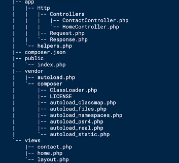
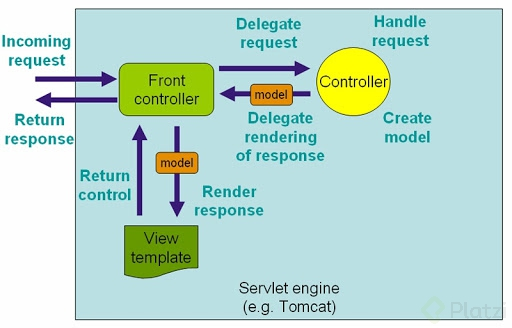
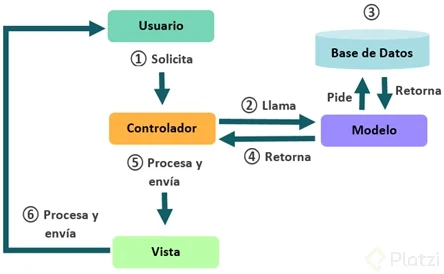

# Frameworks PHP

## Los frameworks como Symfony y Laravel para PHP, sus características notables son:

- Administración de plantillas.
- Manejo fácil y sencillo de una conexión a una DB.
- Funciones pre-hechas.
- Sistema de testing.
- Testing Cache.
- Maneja un estándar para la creación de archivos y carpetas.
- Utilizar frameworks habla de mi dominio del lenguaje y de mis buenas prácticas de escritura de código.

## Estructura de carpetas

> Es la forma que manejamos nuestros desarrollo en un framework es algo muy importante al momento de generar proyectos.

Ejemplo 

## Front Controller

- Es un patrón que nos ayuda a solucionar el problema de acceso único en la web. 
- Este se utiliza para proporcionar un mecanismo centralizado para manejar solicitudes, todas las solicitudes son procesadas por un solo controlador. 
- El controlador puede realizar la autenticación / autorización / registro o solicitud de seguimiento, entonces la petición al controlador adecuado.
- En este caso, vamos a lograr que todos pase a través de index.php, así centralizaremos los accesos. 
- Además, ya no necesitaremos tener un sistema lleno de include para incluir cabeceras o footers.

- 📁 Cuando nos referimos a rutas absolutas quiere decir que la ruta comienza en la raíz del directorio.
- Esto es todo lo que contendrá el archivo index. 
- Este va a cargar todo lo necesario, luego va a disponer de la clase Request porque lo registramos en composer, este va a ejecutar el método enviar.

> Resumen: Básicamente es centralizar todas las peticiones.

- Un controlador, como su nombre lo dice, es una clase que se encarga de hacer todo el procesamiento del request del usuario, ahí es en donde en la mayoría de las veces ejecutaremos la lógica, y por su puesto, se retorna el resultado, en este caso, una vista.
- Como se retorna una instancia de Response, entonces tenemos acceso a todos los datos de la vista que mandamos desde la misma clase.
- Esta es una forma de programación mucho más limpia y ordenada, siempre me gustó trabajar así

## Request

- Siempre se emplea como namespace el directorio de la clase. 
- No es obligatorio pero es lo más recomendable. 
- Los namespaces proporcionan una forma de agrupar clases, interfaces, funciones y constantes relacionadas.

## Request: método send

> En resumen, lo que hace la clase Request es obtener de la URL, qué es lo que el usuario quiere visualizar, entonces, de manera dinámica esta clase busca los controladores necesarios para servirle la respuesta al usuario, realmente lo que se hace es concatenar el controlador pasado en la URL con la palabra Controller para crear el nombre del archivo que debemos mandar 
esumen patatero, request response, forma parte del estándar http cualquier framework o lenguaje del lado de servidor(python, laravel, go, etc) usa esto y en resumen cosiste en:

> request: toda la información enviada desde el cliente , pueden ser json ,formularios, xml , datos en bruto

## Response

> response: el método por el cual se genera una respuesta para el cliente con la información obtenida y procesada

>  la clase Response se está encargando de deducir de igual manera de forma dinámica, dependiendo del request, qué archivo o qué respuesta tiene que enviar, en este caso, busca cuál es la vista que necesita enviar y lo hace de manera dinámica

> La función file_get_contents() se usa para almacenar un sitio web o un archivo en una variable tipo string:

