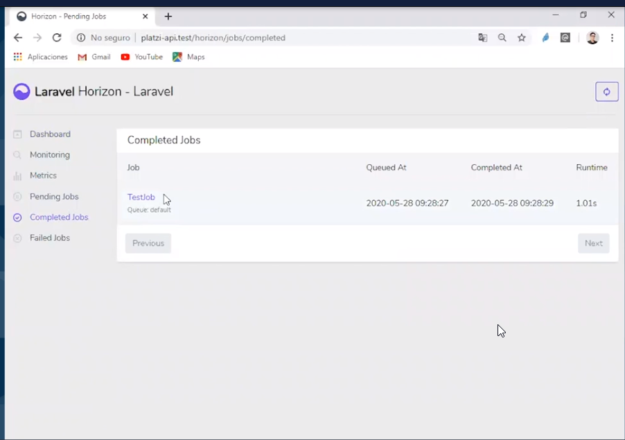
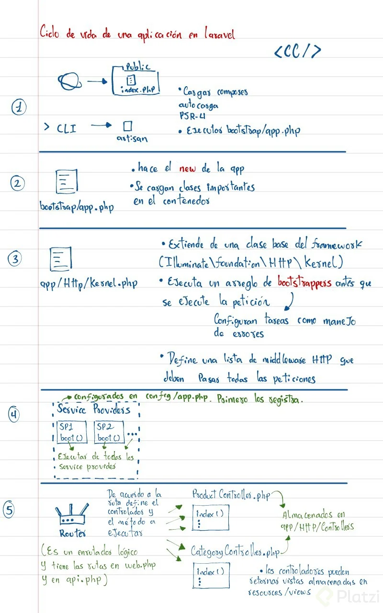

# Curso Avanzado de Laravel  19/10/2021 

## Clase 9 - Manejo de relaciones en bases de datos con Laravel 

> Lo importante para esta clase es mantener las relaciones entre las tablas 
            
- Generalmente Iniciamos En los Migrate definiendo quien es la clave foranea 
- [Ejemplo MI Código](https://github.com/LeoSan/AppCursoLaravel8/blob/main/database/migrations/2021_05_15_012350_create_courses_table.php)			

```
$table->foreign('user_id')->references('id')->on('users');// Campo PK y nombre de la tabla definida en el modelo 
$table->foreign('category_id')->references('id')->on('categories');// Campo PK y nombre de la tabla definida en el modelo 
```

- Luego en los modelos usamos 
- [Ejemplo MI código](https://github.com/LeoSan/AppCursoLaravel8/blob/main/app/Models/Course.php)
			
```
    public function user(){
    return $this->belongsTo(User::class);
    }    

    public function posts(){
    return $this->hasMany(Post::class);
    }
```


## Clase 10 - Relaciones Polimórficas en Eloquent

> Las relaciones polimorficas me permite que un modelo pertenezca a mas de un modelo. 

- [Ejemplo Polimorfismo](info/Relaciones_Polimorficas.png)
- [Ejemplo Polimorfismo Video 1 ](https://www.youtube.com/watch?v=wKOFUzqSh74&ab_channel=RimorsoftOnline)
- [Ejemplo Polimorfismo Video 2 ](https://www.youtube.com/watch?v=rx1DQBE01b0&ab_channel=LaravelDaily)
- [En Laravel El tema de Relaciones Polimórficas ](https://laravel.com/docs/7.x/eloquent-relationships#polymorphic-relationships)
- [El tema de attach ](https://www.amitmerchant.com/attach-detach-sync-laravel/)

```
$table->morphs('rateable'); // Esta es la nueva manera 


$table->string('rateable_type');          //Esta es la vieja manera 
$table->unsignedBigInteger('rateable_id');//Esta es la vieja manera 
```


> Nota: cuando Usamos tablas pivote podemos extenderlo tipo Pivot pero al final es un modelo 
- [Ejemplo MI código](https://github.com/LeoSan/AppCursoLaravel8/blob/main/app/Models/Rating.php)


```
public function rateable(){
    return $this->morphTo();
}

public function qualifier(){
    return $this->morphTo();
}
```


**Tema Complejo. **

> Es importante tener en cuenta que se establecerá una relación polimorfa muchos a muchos (MaM)

[Clase Sencilla de Polimorfismo](https://www.youtube.com/watch?v=rx1DQBE01b0&ab_channel=LaravelDaily)


- Primera parte - Relación a establecer
> Primero que nada hay que entender que es lo que vamos a relacionar a nivel de base de datos, esto es una entidad que 
pueda calificar (un usuario, un invitado, una sesión, etc) con una entidad que pueda ser calificada (producto, categoría, etc.), 
como muchos usuarios podrían calificar muchos productos y muchos productos podrían ser calificados por muchos usuarios 
vemos que se forma una relación MaM, según teoría de bases de datos relacionales, esta relación se puede alcanzar 
mediante tres tablas - una tabla usuarios, una tabla productos y una tabla intermedia o pivote ratings.

- Segunda parte - Migración de tabla Ratings
> Esta tabla tendrá 5 columnas importantes, el score, rateable_type, rateable_id, qualifier_type y qualifier_id, 
los últimos cuatro pueden inferirse por las instrucciones $table->morphs('rateable') y $table->morphs('qualifier'). 
Así que, ¿qué significan esas columnas?, Hay que ver el video del inicio del tema hay que comprender que  
**rateable_type** y **qualifier_type** hacen referencia al modelo que recibe calificación y al modelo que dictó dicha calificación, 
respectivamente - y **rateable_id/qualifier_id** hacen referencia a el registro especifico dentro de la tabla de cada 
type que recibe/dicta la calificación.


- Tercera parte - Modelo Rating
> El modelo Rating extenderá de Pivot y no de Model puesto que nuestra tabla es una de tipo intermedia o 
pivote, Indicamos el campo con un valor inermedio para cumplir con las reglas de normalización cada tabla tendra un ID unico 
 y se indica la tabla a la que nos relacionaremos. 
 Después es como definir cualquier relación de Laravel, 
 tenemos que indicar el nombre del método para acceder a la relación y retornar la relación polimorfa que no toma argumentos 
 porque como puede relacionarse a varios Modelos la función MorphTo se encarga de determinarlo.

- Cuarta parte - Previo al Trait Can Rate
> Aquí es donde el titulo avanzado del curso toma sentido jeje, en un sistema diferente a este (llamemosle un sistema normal) 
lo que se haría sería establecer la otra parte de la relación polimorfa en los modelos específicos, 
por ejemplo en el caso del modelo User describiríamos la relación de la siguiente forma:
´´´
public function ratings()
{
	return $this->morphMany( 'App\Models\Rating', 'qualifier' );
}
´´´
lo cual le indicaría a Laravel como establecer la relación polimorfa desde Usuario con Rating. 
Usamos la  ventaja de los Traits para delegar la responsabilidad de establecer la otra parte de 
la relación polimorfa a una clase en especifico y así poder darle la posibilidad a cualquier clase 
que queramos de poder calificar, 

- Quinta parte - Trait Can Rate
> El método ratings de la clase CanRate es lo que referí como la otra parte de la relación polimorfa ya que se encargará de 
relacionar el modelo que le pasen por parámetro dentro de la tabla ratings usando el **qualifier_id y rateable_id** como 
llaves foráneas para después retornar los ratings (con timestamps) donde el **rateable_type** sea el modelo objetivo y el 
qualifier_type sea el modelo que invoco la relación.

> Luego este método lo que hace es tomar dos parámetros, **modelo y calificación**, el primero hará referencia 
que modelo se va a calificar con el puntaje que se pasa en calificación, por lo que al momento de invocar la 
relación ratings del Trait CanRate podemos encadenar el método attach  para básicamente indicar que se escriba 
en la tabla pivote el id que tenga el modelo relacionado al score ya antes mencionados.


**Otro Manera de entenderlo**

## EJEMPLO1:
- Un USER le puede dar likes a muchos VIDEOS de YouTube.
- Y Un VIDEO de YouTube puede tener likes de muchos USERS.
- Esto es una relación muchos a muchos, así que se hace una tabla pivote entre ambas, que tenga el user_id y el video_id.
- Hasta aquí estamos bien.


## EJEMPLO2:
- Ahora supongamos que YouTube, además de videos, tenga imagenes. Entonces nace una nueva relación muchos a muchos entre USER e IMAGES. Crearías una tabla pivote que tenga el user_id y el image_id.
- Listo. Entonces quedaría así:
´´´
ejemplo1: user_id y video_id
ejemplo2: user_id y image_id
´´´ 
- Estas dos tablas son muy parecidas. 
- Entonces alguien quiso ahorrarse las dos tablas, y tener una sola que haga todo eso, y aquí es donde entra la relación polimórfica:
	- Una tabla que tiene: user_id, likeable_type y likeable_id.
	- El likable_type sería VIDEO, o IMAGE o etc
	- Y el likable_id sería el ID del likeable_type. (video_id ó image_id ó etc)
	
	
## Terminal  Laravel 
## Clase  11 - Cómo crear comandos para la terminal de Laravel

> Es una forma de generar y administrar tus propios comandos 

- [Laravael Doc - Comandos](https://laravel.com/docs/7.x/artisan#writing-commands)


> Nota: Cuando ejecutamos este comando genera un directorios donde podemos visualizar los archivos que permiten el uso del mismo `app\Console\Commands\EnvioCorreo.php`
- Asi creamos un comando : `php artisan make:command NombreNewsLetterCommand[EnvioCorreo]`
- Debemos configurar en la clase que genero el artisan como los vamos a ejecutar en consola dicho comando.
```
	protected $signature = 'command:envio';
```
- Asi ejecutamos el comando tal cual lo que definimos en la variable **$signature** : `php artisan command:envio`

## Notificaciones de Laravel 

> Existe un componente dentro de laravel que nos permite crear, enviar, modificar emplear notificaciones a nuestros sistema sin necesidad de estar creandolos desde cero. 

Notas: 
- [Material para las notificaciones](https://laravel.com/docs/7.x/notifications#introduction)
- Existe un comando en artisan `php artisan make:notification NombreDetuNotificacion`
- Las notificaciones se crean en el siguiente directorio: `app\Notifications\EnvioCorreo.php`
- Mailtrap para correo 
```
MAIL_MAILER=smtp
MAIL_HOST=smtp.mailtrap.io
MAIL_PORT=2525
MAIL_USERNAME=
MAIL_PASSWORD=
MAIL_ENCRYPTION=tls
MAIL_FROM_ADDRESS=cc_digitalizacion@impaqint.com
MAIL_FROM_NAME="${APP_NAME}"
```
- Como paso final ejecutamos nuestro comando de esta manera y lo que hace es el envio de correos usando mailtrap, claro hay que señalar que las notificaciones ya vienen  con cierta plantillas por lo que hay que buscar como editarlas. 
- `php artisan command:envio`


## Clase 12 - Ejecutando comandos desde la API

> Tambien podemos ejecutar comandos usando nuestros controladores y estos se puedan ejecutar en alguna ruta del navegdaor. Podemos hacer lo siguiente: 

- Paso 1: Podemos crear en nuestro controlador el seguiente metodo, claro importando previamente tu clase de comando y la clase artisan que se encarga de ejecutar comando con el metodo call(). 

```
use App\Console\Commands\EnvioCorreo;
use Illuminate\Support\Facades\Artisan;
```

- Paso 2: Incorporamos metodo 
```
    
    /**
     * Este Metodo permite activar un comando en consola personalizado 
     * */ 
    public function comandoActivo (){
        define('STDIN',fopen("php://stdin","r"));
        //Importamos el artisan
        // Importamos el Commands      
        $result =   Artisan::call(EnvioCorreo::class);
        
        return response()->json(['data'=>$result]);

    } 
```

- Paso 3: Probamos en nuestro navegador y listo, `http://appcursolaravel8.test/comando`

## 13 - Programación de tareas

>Laravel nos permite programar tareas automáticas por

- Paso 1: Debemos registrar los comando en el kernel `app\Console\Kernel.php`
``` 
use App\Console\Commands\EnvioCorreo;

    protected $commands = [
        EnvioCorreo::Class
    ];
``` 

- Paso 2: Ubicamos el metodo schedule, dentro de la clase  `app\Console\Kernel.php`, este metodo nos permite decidir cuando y que vamos a ejecutar para este ejemplo lo ejecutaremos diariamente para mas información [Laravel 8 - schedule ](https://laravel.com/docs/7.x/scheduling)

```
    protected function schedule(Schedule $schedule)
    {
        /**Comando de prueba */ 
        $schedule->command('inspire')
                 ->evenInMaintenanceMode()
                 ->sendOutputTo(storage_path('inspire.log'))
                 ->daily();

         $schedule->call(function (){
            echo "****Ejecutando comando Diariamente****";
         });
         
         /**Comando desarrollado */ 
         //$schedule->call(EnvioCorreo::class); // Otra forma de ejecutar
         //$schedule->command(EnvioCorreo::class)->onOneServer() // Tambien lo puedo ejecutar asi 
         $schedule->command('command:envio --schedule')->onOneServer() // No me funciono de esta manera 
         ->withoutOverlapping()
         ->daily();
    }


```

- Paso 3: Podemos ejecutar de la siguiente manera `php artisan schedule:run` 


## 14 - Eventos y Listeners en Laravel

>Laravel contiene un manejador de eventos en el cual me permite disparar distintos eventos en cualquier ciclo o proceso de vida que requerimos en nuestra aplicación. Est


**Caracteristicas**
- Los eventos son escuchados por nuestros Listeners. 
- Los eventos son todas las acciones que el usuaio inicia.(Dar Clic, pecionar teclas)
- En Laravel existen clases auxiliares llamadas  Listeners. 
- Estas lases reciben eventos especificos y ejecutan una acción. 
- Listeners: DISPARADORES a través de los EVENTOS. Ejemplo: ENVIAR mail debido a una REGISTRACIÓN.


**Donde se ubica**
- Directorio Principal -> `app\Providers\EventServiceProvider.php` 

**Como Podemos iniciar**
- Paso 1: Podeos crear una clase tipo evento ejecutando el siguiente comando `php artisan make:event ModelRated` Genera esta clase en la siguiente ruta -> `app\Events\ModelRated.php`
- Paso 2: En la clase creada podemos definir nuestro proceso bien sea en el constructor o un metodo que consulte y realice un cambio en la base de datos.
- Paso 3 : Ubicamos donde lo queremos disparar o escuchar bien sea un controlador, traits, y solo importamos nuesto eventos y usamos el helpers event(). 

```
//Importamos al principicio de la clase de
use App\Events\ModelRated;
use Illuminate\Database\Eloquent\Model;

//Forma de disparar eventos 
event(new ModelRated($this, $model, $score));
```

Paso 4: Debemos crear nuestro listener para que pueda ser escuchado y ejecutado el comando es el siguiente `php artisan make:listener NombreDelListener`, lo genera en el siguiente directorio -> `app\Listeners\EnvioCorreoListener.php` -> Aqui anexamos el proceso que realizará el evento. 

- Paso 5: Debemos registrarlos en nuestro **eventServiceProvider** Debemos importar nuestro event y nuestro listener recuerda que estos van de la manos 
```
use App\Events\ModelRated;
use App\Listeners\EnvioCorreoListener;
```
Luego alimentamos nuestro arreglo 

```
    /**
     * The event listener mappings for the application.
     *
     * @var array
     */
    protected $listen = [
        Registered::class => [
            SendEmailVerificationNotification::class,
        ],
        ModelRated::class=>[
            EnvioCorreoListener::class

        ]
    ];
```

## Otra forma de generar eventos y listeners 
> Podemos ejecutar directamente es escribiendolos en el EventServiceProvider con su namespace completo dentro del array de eventos y Laravel tiene un comando especial para generar ambos directamente lo cual puede ser un poco mas productivo en terminos de crear codigo mas rapido el comando es: `php artisan event:generate`

## 15 - Eventos de Eloquent


>Eloquent tambien tiene eventos los cuales permite  captutar distintos momentos del ciclo de vida de un modelo  [Documentación Oficial](https://laravel.com/docs/7.x/eloquent#events)


**Ejemplo** Vamos a crear una imagen de cuando se cargue un  producto 

- Paso 1: Podemos escoger un modelo y definir un metodo estatico de la siguiente manera: <
```

//Este metodo nos ayuda a crear una imagen facker cuando no se tiene alguna imagen 
protected static function booted() {
    //Se ecjecuta antes de crearse la entidad 
    static::creating(function (Course $course) {
        $faker = \Facker\Factory::create();
        $course->image = $faker->imageUrl();
        $course->user_id->associate(auth()->user());
    });
}

```


## 16 - Queries y JOB

> Nos permite ejecutar procesos en segundo plano de la

**Esto es una Forma** 

- Paso 1: Podemos generar una clase listener 
```
`php artisan make:listener NombreDelListener`, lo genera en el siguiente directorio -> `app\Listeners\EnvioCorreoListener.php` -> Aqui anexamos el proceso que realizará el evento. 

```

- Paso 2: Al crear la clase podemos inplementar la interfaz `ShouldQueue` con esto le indicamos a laravel cada vez que levante un **listener** lo haga como un **Job**

- Paso 3: Podemos ejecutar el comando `php artisan queue:work` ->  Este ejecuta los procesos listados en la tabla job y queda escuchando para validar si hay mas procesos. 


**Otra Forma**

- Paso 1: podeos crear un job con el comando -> `php artisan make:job NombreJob`, esto genera una clase ubicada en `app\Jobs\JobEnvioCorreo.php`

- Paso 2: Podemos construir el proceso que querramos en la clase en el método handler: 

```
    public function handle(Login $event)
    {
        //
        $user = $event->user; //
        $user->profile_photo_path = 'https://c8.alamy.com/zoomses/9/d4c59d90389444e3b1166312d2f7fa51/p9mywr.jpg';
        $user->save();

    }

```

- Paso 3: Debemos agregar el job a la clase evento donde se listan todos los listener o job: **eventServiceProvider**
Claro no olvides importarlos 
use Illuminate\Auth\Events\Login;
use App\Jobs\JobEnvioCorreo;


``` 
    protected $listen = [
        Registered::class => [
            SendEmailVerificationNotification::class,
        ],
        ModelRated::class=>[
            EnvioCorreoListener::class

        ], 
        Login::class=>[ //Recuerda este debe ser un evento
            JobEnvioCorreo::class, //Este debe ser un job o listener
        ]
    ];

``` 

- Paso 4: Ejecutamos el comando para activar los job `php artisan queue:work`

> Nota: Funciona pero no carga en la tabla jobs, al final lo que hace es actualizar un campo y envia un correo, aqui dejo tambien un ejemplo de como enviar correo en laravel usando plantillas 


## Clase 17  - Laravel Horizon

> Es un paquete que nos porporciona un panel de control de un sistema configurable de las colas lo cual nos permite monitorear el funcionamiento de las Colas. Est

- [Documentación Horizon ](https://laravel.com/docs/7.x/horizon#introduction)
  
- Paso 1: Solo funciona en Linux, `composer require laravel/horizon`
- Paso 2: Pasamos a instalar e artisan -> `php artisan horizon:install`
- Paso 3: Ubicamos en config `config` -> Horizon -> Debemos ubicar las variables de ambiente 
```
'environments' => [
    'production' => [
        'supervisor-1' => [
            'connection' => 'redis',
            'queue' => ['default'],
            'balance' => 'simple',//
            'processes' => 10,
            'tries' => 1,
        ],
    ],

```
- Paso 4: Podemos acceder via navegador al tablero `http://appcursolaravel8.test/horizon`
- Paso 5: Debemos mantener activado el horizon -> `php artisan horizon` -> Lavanta el servio de horizon 

**Asi se ve Horizon con interfaz**




## Clase 18 - Cómo capturar y leer errores con la clase Handler

> En Laravel 8 existe un nuevo método dentro de Handler llamado “register” en donde registras la ejecución de varias funciones “reportable” y dentro de cada una de ellas puedes retornar la respuesta que necesites. No obstante, aún siguen disponibles los métodos report y render, pero hay que escribirlos a mano, dejo la documentación:

- Ubicación  -> `app\Exceptions\Handler.php`
- [ Error - Handlers ](https://laravel.com/docs/8.x/errors)

> Para usar servicios externos ó para capturar error y notificarlos, pueden usar Sentry totalmente gratis para que lo puedan probar con su proyecto personal o un proyecto de un cliente 😃 `https://sentry.io/`

> Nota: La pagina de excepciones que aparece es la que sale por defecto ante cualquier error en Laravel. Aquí lo bueno es poder utilizar esta misma plantilla para generar exepciones personalizadas.

## Clase 19 - Excepciones personalizadas
> Es una forma de personalizar las exepciones generalmente en los proyectos esto no es tan importante  ya que Laravel tiene su forma de avisarte sobre las excepciones, pero si deseas hacer mensajes personalizados cuando tenemos exepciones controladas podemos hacer los siguietes paso. 

Pero ante se debe ver y leer la documentación: 

- [Video Tuto Youtube](https://www.youtube.com/watch?v=1j_5IB7qUhk&ab_channel=MateusGuimar%C3%A3es)
  
## Clase 20 : Excepciones HTTP personalizadas y debugging con Laravel Telescope

> Podemos personalizar los errores 404 o los 401 o los errores 500, podemos usar los helpers  

- Paso 1: Para personalizar debemos publicarlas podemos ejecutar el siguiente comando para realizar dicha tarea. `php artisan vendor:publish --tag=laravel-errors` -> Este comando lo que hace es en la ruta **views(resources\views\errors\401.blade.php)** mostrar las interfaces de los diferentes errores que se manejan en lavarel permitiendo editarlar

- Paso 2: Podemos instalar un paquete llamado telecope para validar nuestras variables podemos instalar -> `composer require laravel/telescope` Luego ejecutamos el comando `php artisan telescope:install`

- Paso 3: debemos ejecutar una migración para poder visualizar el servicio `php artisan migrate`
- Paso 4: Podemos acceder por le navegador generando una interfaz para debugerar `http://appcursolaravel8.test/telescope/requests`
- 

## Clase 21 : Configuración de logs y channels en Laravel


## Clase 22: Ciclo de vida de una aplicación en Laravel

Aunque parezca magia, Laravel no hace las cosas exentas de las funcionalidades base de Php, mientras más trabajamos con Laravel, nos surgen preguntas de cómo funcionará todo. En esta clase vamos a explicar brevemente cómo actúa Laravel desde el momento que un usuario hace una petición a nuestro servidor y cómo consigue una respuesta.


Esto se llama Ciclo de vida de una Petición. Laravel nos hace todo tan fácil, que el cómo funciona queda en segundo plano, pero conocerlo hace que nos sintamos más cómodos al trabajar y que desaparezca esa sensación de que todo es por arte de magia.

Laravel está pensado para que el DocumentRoot de la aplicación sea la carpeta public. En ella vamos a encontrar el punto de entrada a todas las peticiones que reciba nuestro sitio web, el cual es el archivo index.php, en cambio si la aplicación es CLI tendremos el archivo artisan.php

Estos archivos no tienen mucho código, pero lo poco que tienen es muy importante debido a que se carga la instancia de Laravel a través de la carga automática generada por Composer, que veremos más adelante.

Si abrimos el archivo bootstrap/app.php encontramos el new de mi aplicación, y además cargamos algunas clases importantes dentro del Contenedor de Laravel.

Después de cargar, el siguiente paso, dependiendo del tipo de solicitud, el framework dirige el procesamiento al Kernel HTTP o al Kernel de Consola. Estos dos núcleos son donde todo fluye en Laravel.

El Kernel HTTP, ubicado en app/Http/Kernel.php extiende de una clase base del framework que tiene un arreglo llamado bootstrappers que se ejecutan antes de que la petición se ejecute, los mismos configuran tareas como la captura de errores, entre otros, además el Kernel define una lista de middleware HTTP que todas las solicitudes deben pasar antes de que la aplicación las maneje. Estos middleware manejan la lectura y escritura de la sesión HTTP, determinan si la aplicación está en modo de mantenimiento, verifican el token CSRF, entre otras cosas.

El siguiente paso del Kernel es cargar proveedores de servicios (Service Providers) como parte de la acción de arranque. Dentro de config/app.php podemos encontrar los proveedores necesarios para la aplicación. Los mismos se registran y una vez que todos los proveedores estén registrados, se llamará al método de boot de cada uno.

Una vez que la aplicación ha sido iniciada y todos los proveedores de servicios están registrados y arrancados, la solicitud será entregada al Router para su envío. El Router enviará la solicitud a una ruta o controlador, así como ejecutará cualquier middleware específico de la ruta.

El Router dirigirá la solicitud HTTP a un controlador o devolverá una vista o respuestas directamente omitiendo el controlador. Estas rutas se colocarán en app/routes.php.

Los controladores normalmente ubicados en app/Http/Controllers realizarán acciones específicas y envían datos a una vista.

Las vistas ubicadas en resources/views darán formato a los datos de manera adecuada, proporcionando la respuesta HTTP y con esto cerrando el ciclo de vida.

En la siguiente clase, veremos un poco sobre los Service Containers, qué son y qué función cumple dentro de Laravel.

## Clase 23:  ¿Qué son los service containers?

>La inyección de dependencias es parte de el principio de inversión de dependencias que son parte de las buenas prácticas de escritura de código.

```Nota: Resumen Este patrón de diseño consiste en cambiar un poco la lógica de nuestro código, de forma que en caso necesitar un método o atributo de alguna otra clase, no debamos llamar a esa clase directamente, sino escribir código lo suficientemente flexible como para que nos permita integrar (inyectar) cualquier otra parte de la aplicación```

- [documentación container](https://laravel.com/docs/7.x/container#introduction)

> Nota: La Inyección de Dependencias nos ayuda a cumplir con los últimos 2 principios SOLID:
- Interface Segregation: NO debemos forzar nuestras clases a implementar atributos o comportamientos que no necesitan.
- Dependency Inversion: Debeomos a desacoplar nuestras clases, no deben tener dependencias/referencias a otras clases de forma muy estricta


## Clase 24:  ¿Cómo funciona un service container?

> El Service Container es una herramienta poderosa para administrar las dependencias de clases, nos permite realizar inyección de dependencias. Cuando hablamos de inyección de dependencias significa que las dependencias de clase se “inyectan” en la clase a través del constructor o, en algunos casos, métodos “setter”.


```
Hay muchas maneras de acceder a la instancia del container, en Laravel es tan simple como usar el helper app().

$container = app();

```

## Cómo funcionan los Service Containers
Una de sus funciones es poder inyectar una dependencia dentro de una clase por medio del constructor, por ejemplo:

De manera que, en lugar de tener que hacer un new AnotherClass, simplemente lo colocamos como parámetro del constructor. El contenedor va saber cómo instanciar las dependencias de tal manera que, suponiendo que AnotherClass no tiene dependencias propias, sería algo como:

```
$instance = new MyClass(new AnotherClass());
```

Si tuviera dependencias propias, el container también la va a resolver de manera recursiva hasta que no haya más.

Una comprensión profunda del Service Container de Laravel es esencial para construir una aplicación potente y grande, así como para contribuir al core de Laravel.

## Cómo usamos los servicios dentro del container de una aplicación

Acá es donde aparece la palabra binding, uno de esos términos que se aplica en muchos lugares, pero que en Laravel nos ayuda a vincular un servicio a la Aplicación. Al hacer esto, podemos vincular implementaciones de nuestras dependencias o servicios y poder acceder a ellas dentro del Container. Casi todos los bindings del contenedor de servicios se registran en los Services Providers.

Y, por otro lado, no es necesario vincular clases en el Container si no dependen de ninguna interfaz, ya que se resuelven mediante reflexión. Pero si necesitamos levantar servicios específicos o que dependen de una interfaz, dentro de la documentación de Laravel vamos a encontrar como hacer los distintos tipos de Bindings: https://laravel.com/docs/7.x/container#binding.

```
Por ejemplo, dentro de un Service Provider:


$this->app->bind(

'App\Contracts\PaymentGateway',

'App\Services\MercadoPagoGateway'

);

Esta declaración le dice al Container que debe inyectar el MercadoPagoGateway cuando una clase necesita una implementación de PaymentGateway. Ahora podemos utilizar en cualquier parte de nuestra aplicación la interfaz PaymentGateway.


public function __construct(PaymentGateway $payments)

{

$this->payments = $payments;

}
```

## Clase 25:  Registro y carga de clases con service providers

> Es una manera de registrar nuestros propios provider propios

**Caracteristicas**
- Se encuentra en esta Ruta-> `app\Providers\`
- Podemos crear nuestros propios provider con el comando `php artisan make:provider NombreProvider`
- Si creamos nuestros propios provider debemos registrarlos en la siguiente ruta-> `config\app.php` en el arreglo ` 'providers' => []`
- Service Providers -> `https://laravel.com/docs/7.x/providers` 
- View Composers -> `https://laravel.com/docs/7.x/views#view-composers` -> composer() es basicamente un callback que se llama cada vez que se va renzerizar un view, en este caso home.blade.php

**Método Registe**
Registrará las clases o servicios que necesitan estar cargadas dentro del container. 

**Método Boot**
Se usa para cargar todos los elementos o metodo que no podemos insertarlos en el metodo regiter. 

**ciclo de vida** 




## Clase 26: ¿Cómo crear mis propios paquetes de Laravel?
Este tema esta complejo por el momento no siento que lo necesite  

> Palabras fuertes, yo pienso que deben actualizar este curso de una mejor manera

## Clase 27: ¿Cómo crear mis propios paquetes de Laravel?


## Propiedades para manejo de dependencias en composer.json


Las dependencias de un proyecto se indican dentro del archivo composer.json. Allí tendremos disponible require, lugar para indicar los paquetes que obligatoriamente se deben instalar para poder ejecutar el proyecto, de tal manera que si alguna de estas dependencias no se puede instalar, composer no te dejará instalar el proyecto.

Por otro lado, tenemos la propiedad require-dev para enumerar los paquetes necesarios para desarrollar la aplicación en construcción, no en producción (por ejemplo, los Tests). Estas dependencias solamente se instalan si el comando install se ejecuta con la opción --dev o si el comando update se ejecuta con la opción --no-dev.

Cada dependencia está identificada mediantes objetos que se asocian a los nombres de los paquetes junto con su versión, por ejemplo:

{ "require": { "laraveles/spanish": "1.0.*" } }
Por ejemplo “laraveles/spanish” indica que “laraveles” es el vendor y “spanish” es el nombre de la librería.

¿Cómo decidimos la versión?
Sabemos que composer usa el repositorio de Packagist, entrando allí puedes encontrar la lista de versiones liberadas de esa librería y disponibles como paquetes. Lo que vemos en el ejemplo es una sintaxis de composer que nos ayudan a trabajar con las versiones.

Por ejemplo, para indicar una versión exacta basta con escribir el número “1.4.6”, así composer SIEMPRE va a instalar la misma versión de esa librería.

También podemos colocar un rango de versiones, que nos permite indicar versiones que sean mayor que una determinada, menor o que esté entre una versión y otra. Por ejemplo: “>=1.0”.

Podemos usar el comodín () para ayudarnos a escribir expresiones mucho más fácil, si tenemos “1.0.”, quiere decir que nos va a instalar una versión >=1.0,<1.1.

Si vemos “~2.4”, indica que vamos a instalar la siguiente versión significativa, es decir, esta fórmula instala cualquier versión mayor o igual que 2.4 y menor que 3.0.

También te permite versiones como “dev-master”, la versión actual de desarrollo, que puede darse el caso que no sea estable, “1.0.*@beta” que te permitirá colocar versiones beta o “@dev” que también referencia a versiones de desarrollo que pueden sufrir inestabilidad.

Si queremos mas detalles, podemos encontrarlos en la documentacion oficial: https://getcomposer.org/doc/articles/versions.md.

Ademas de require y require-dev, tenemos otras propiedades con la cual podemos indicar otras características, por ejemplo, la propiedad conflict indica los paquetes que son incompatibles con esta versión concreta del paquete. El resultado es que esos paquetes incompatibles no se instalarán al descargar las dependencias.

También tenemos la propiedad suggest donde se pueden enumerar todos los paquetes que sugerimos por el conjunto de paquetes actualmente instalado.

En esta clase aprendimos que las propiedades require y require-dev nos permiten indicar con una precisión exacta la versión de una dependencia. En la siguiente conoceremos más propiedades del archivo composer.json.


## Clase 28: Comprende el archivo composer.json

Composer se ha convertido en una herramienta de cabecera para cualquier desarrollador PHP que aprecie su tiempo y el desarrollo ágil. Composer, como ya lo sabemos, se centra en un archivo llamado composer.json.

Dentro de un JSON se puede definir la estructura del documento, así como los valores posibles que tengan cada uno de sus campos. La dirección concreta donde puedes encontrar la descripción completa del schema del composer.json la encuentras aquí: https://getcomposer.org/doc/04-schema.md.

En esta clase vamos a estudiar los más conocidos. Recuerda que el archivo composer.json se encuentra por defecto en la raíz del proyecto.

- name:
Sirve para indicar el nombre del autor, se compone de dos partes, el “vendor” (la empresa o nick del desarrollador o grupo que lo ha creado) y el nombre del proyecto propiamente dicho. Por supuesto, un vendor puede crear diversas librerías o paquetes y quedarían todas vinculadas al mismo vendor con nombres de proyectos distintos.

- description:
Es la descripción que ofrecemos de este paquete. Es un texto normalmente de una única línea.

- homepage:
Una URL del sitio web del proyecto.

- authors:
Es un array con los autores del proyecto. Cada uno de los elementos de ese array es a su vez un objeto JSON donde se pueden indicar distintos datos: name, email, homepage, role (rol dentro del proyecto).
```
"authors": [
    {
   	 "name": "Sergio Ojeda",
   	 "email": "soj3da@gmail.com",
   	 "homepage": "http://www.desarrolloweb.com",
   	 "role": "Developer"
    },
    {
   	 "name": "Ari Juanico",
   	 "role": "Beta tester"
    }
]
```
- license: en este se indica el tiempo de licencia del proyecto.

- conflict: enumera los paquetes que entran en conflicto con la versión de nuestro paquete. No se permitirá instalar estos paquetes en nuestro paquete.

- suggest: indica los paquetes que pueden mejorar o funcionar bien con este paquete. Esto se muestra después de nuestro paquete, indicando a los usuarios algunos de los paquetes adicionales que podrían instalar. Este también es un campo opcional.

- autoload: proporciona un cargador automático de PHP. Los dos tipos de carga automática son “PSR-4” y “PSR-0”

- minimum-stability: determina el mínimo de estabilidad de los paquetes que se instalarán. El valor predeterminado es “estable”. Se recomienda especificar siempre esto si retransmiten en el paquete de desarrollo.

- prefer-stable: cuando está habilitado, composer prefiere paquetes estables que los no estables. Para habilitar, usa (“prefer-stable”: true).

- repositories: define los repositorios personalizados que se utilizarán. Por defecto, el compositor usa Packagist, la definición de estos repositorios hará que el compositor busque paquetes en los repositorios especificados.

- extra: datos adicionales, prácticamente puede ser cualquier cosa, en laravel se usa para cargar los Service Providers
```
"extra": {
    	"laravel": {
        		"dont-discover": []
    	}
},
```
- scripts: composer te permite conectar varias partes del proceso de instalación mediante el uso de scripts. En esta parte se indican los scripts a ejecutarse dentro del ciclo de vida de composer e incluso para ser usado como alias de otros comandos.
https://getcomposer.org/doc/articles/scripts.md

Así como los que mencionamos, existen más tipos de configuraciones que podremos ver más en detalle en la documentación oficial.

En la siguiente clase continuaremos estudiando un poco de composer y veremos cómo funciona la autocarga de clases.

> Nota: :En la actualidad para la creación de algún software profesional se utiliza un sistema de gestión de paquetes.
- Para PHP esta Composer.
- Para Java esta Maven.
- Para Python esta PIP.
- Para JavaScript esta NPM.

## Clase 29: Extendiendo composer.json, autocarga de clases y PSR-4

**Características**
- PSR-4 Es una especificación para cargar las clases de manera automática.  
- Es interoperable y se puede usar además de cualquier otra especificación. como el PDR-0 
- Describe donde colocar los archivos que se cargaran automáticamente de acuerdo con la especificación. 
- PSR-4 con este estándar tenemos una nomenclatura de como cargar nuestras clases
- Lo definimos en el autoload del composer.json 
- Podemos usar dentro de composer en la propiedad `autoload` especificar un `classmap` esto nos permite cargar carpetas 
- Si queremos usar helper es necesario especificarlo en esta propiedad `autoload` y crar `files` y anexar la ruta del helpers. 

> Nota: 
- PSR-4 Es una convención que en resumen te dice que debes poner los namespaces como si fueran las rutas de tus carpetas. Y de hecho si no los pones así, composer no será capaz de encontrar tus archivos y no podrá cargar las clases

```
    "autoload": {
        "psr-4": {
            "App\\": "app/",
            "Database\\Factories\\": "database/factories/",
            "Database\\Seeders\\": "database/seeders/"
        },
        "classmap":[
            "database/seeds",
            "database/factories",
        ],
        "files":[
            "app/helpers.php"
        ]
    },

```
## ckase 30: Crear mis propios Services Providers

> Son la unidad central dentro de la aplicación de laravel pues me permite registrar servicios, modelos de negocio, clases especaales como : binind, listener y migrations

- Documentación `https://laravel.com/docs/7.x/packages#service-providers` 

> Usar interfaces (Contracts en este caso) te ayuda a estar seguro de que cualquier cosa que te pasen por parámetro que use tal interfaz va a contener el método que estés usando dentro del código, así que hace que todo sea más “estricto” por así decirlo.


## Clase 31: Publicación de archivos

La publicación de archivo es cuando Laravel copia dichos archivos al proyecto en sí (Cuando usamos el comando publish dentro de Laravel, por ejemplo), y si estos archivos son importantes para nuestro paquete entonces debemos permitir que puedan ser publicados para que cualquier otra persona que trabaje con el paquete pueda configurarlo y disponer de la migración en caso de haberla.

- Documentación `https://laravel.com/docs/7.x/packages#resources`
- Super complejo.

## Clase 32: Uso de repositorios locales

> Al final acabamos reemplazando todo por el repositorio remoto y ahora es composer quien lo maneja, lo interesante de esto es que ahora cualquier persona puede acceder a ese repositorio y clonarlo 


> Nos permite tener una aplicación mas sencilla sin afectar su funcionamiento, sin embargo opino que ese repositorio deberia estar de alguna forma documentado.
```
Para el desarrollo de paquete utilizo esta opción
	"repositories": [
        {
            "type": "path",
            "url": "path/to/package"
        },
url apunta a la dirección relativa de mi paquete en la url podemos apuntar a github        
```
