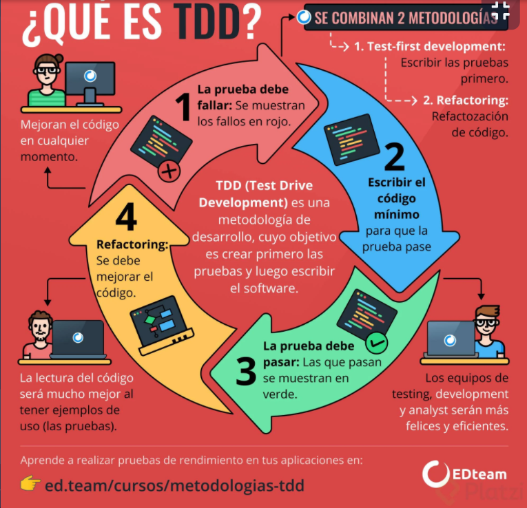

# Curso Básico de Testing con PHP y Laravel - 01-11-2021 

<p align="center"><a href="https://laravel.com" target="_blank"></a></p>


## Clase 1 : Todo lo que aprenderás sobre testing con PHP y Laravel

> Manejo Introductorio. 

## Clase 2: La función del testing

**¿Para qué nos sirve el testing?**
- Es una herramienta que nos ayuda a respaldar el código que hemos hecho, evitando que se envíen errores a producción. 
- De la misma manera al hacer cambios en nuestro código, nuestras pruebas deben ser actualizadas para que coincidan con estos cambios.
- El testing no te va a asegurar que tu aplicación no tenga bugs, pero sí te va a asegurar que esos bugs que encuentres ya no vuelvan a surgir”.

## Clase 3: PHPUnit en Laravel


> Laravel al instalarlo trae PHPUnit configurado dentro de la carpeta 
📁test encontrarás dos carpetas 
- Unit (Donde tenemos pruebas unitarias) 
- Features (Donde tendremos las pruebas de pedazos de código grandes).
- Con este comando podemos ejecutar las pruebas ->`php artisan test` -> Trabajar con Laravel Unit 
- Con este comando podemos ejecutar las pruebas ->`vendor/bin/phpunit` -> trabajar con phpunit

## Clase 4: Unit y Feature
> Podemos crear nuestras pruebas usando artisan. 

> Una prueba unitaria es cuando tú pruebas una función en específico, es decir, algo muy específico que quieres saber que funciona, por ejemplo, suponiendo que tienes un programa que va a hornear un pastel, una prueba unitaria sería asegurarte que la masa se está horneando correctamente, otra prueba unitaria sería asegurarte que el horno realmente está calentando.

> Una prueba de features es cuando tú pruebas ese conjunto de funciones, por ejemplo, cuando tú pruebas que realmente de tu cocina se está horneando un pastel, porque tus pruebas unitarias pueden estar bien, es decir, puede que la masa se esté haciendo bien y que el horno sí esté calentando, pero puede que de ahí estén saliendo galletas en lugar de un pastel, por eso la prueba de features es asegurarte que todas esas pequeñas funciones del sistema están trabajando bien entre sí 😄

**Caracteristicas**
- Comando para crear pruebas `php artisan make:test NombrePrueba`

## Clase 5: El resultado

> Este también es un concepto importante para el testing, sobre todo porque muy comúnmente nosotros vamos a tener nuestra programación por allá en los controladores, ese va a ser nuestro “código de producción”, entonces básicamente los testing lo que hacen es decir: “Ok, me voy a jalar este código para acá y vamos a probar si es cierto que funciona”, y tanto tu aplicación en producción como el testing van a estar usando el mismo código, pero el testing es el que te va a decir “Oye, esto sí funciona”, mientras más casos de prueba tengas mejor 😄

**caracteristicas**
- Podemos crear nuestras pruebas e indicarle en que carpeta debe quedar ` php artisan make:test Herlpers/EmailTest --unit`
- Recuerda usar la nomeclatura para las pruebas siempre debe terminar en test ejemplo ValidaNomreTest.php
- Recuerda que las pruebas las debes definir en las ramas principales **Unit** o **Feature** 
- para ejecutar test en especifico podemo usar `php artisan test --filter NombreTuTest`
- Podemos ver los metodos assertions (
afirmaciones) en su documentación `https://phpunit.readthedocs.io/en/9.5/assertions.html` estos métodos nos ayuda a realizar pruebas de nuestras variable o funciones. 

## Clase 6 : Probar un Helper

> Realizamos un ejemplo sencillo. 

- Paso 1: Podemos crear un helpers.php en app, no olvides cargarlos en el composer
- Paso 2: Cargamos en el composer: y ejecutar el comando `composer dump`
```
      "autoload": {
        "psr-4": {
            "App\\": "app/",
            "Database\\Factories\\": "database/factories/",
            "Database\\Seeders\\": "database/seeders/"
        },        
        "files":[
            "app/Helpers.php"
        ]
    },
```
- Paso 3: Podemos crear nuestro test -> `php artisan make:test Herlpers/FunctionsTest --unit` 
- Paso 4: Siguiendo lo basico de test podemos crear nuestra logica de test:
```
<?php

namespace Tests\Unit\Helpers;

use PHPUnit\Framework\TestCase;

class FunctionsTest extends TestCase
{
    /**
     * A basic unit test example.
     *
     * @return void
     */
    public function testEmail()
    {
        $email = 'i@admin.com';
        $emailFalse = 'i@@admin.com';
        $result = validate_email($email);
        $this->assertTrue($result);

        $resultFalse = validate_email($emailFalse);
        $this->assertFalse($resultFalse);
    }
}

```
- Paso 5: Podemos ir testienado con el comando `php artisan test --filter FunctionsTest` -> Esto nos causara una falla ya que aun no hemos programado la logica en el helpers. 
- Paso 6: Pasamos al helpers y creamosla logica 
```
<?php

if (!function_exists('validate_email')){

    function validate_email($email){
        return App\Helpers\Email::validate($email);
    }

    

}
```
- Paso 7: volvemos ejecutar el comando `php artisan test --filter FunctionsTest` y ya nos indica que todo esta bien. 

## Clase 7 : Accessors y Mutators

**Mutator**
Un Mutator transforma un atributo antes de ser almacenado.
**Accessor**
Un Accessor transforma un atributo antes de ser presentado.


## Clase 8: Método personalizado

> La diferencia entre un mutator/accessor y un método personalizado es que los primeros solo se ejecutan sobre propiedades de la clase

Getter: Su función es permitir el obtener el valor de una propiedad de la clase y así poder utilizar dicho valor en diferentes métodos.

Setter: Su función permite brindar acceso a propiedades especificas para poder asignar un valor fuera de la clase.

Un método en programación es una función que tiene un conjunto de instrucciones definidas dentro de él. El método tiene un nombre para identificarlo. Podemos hacer que requiera diferentes tipos de datos de entrada para ejecutarse. Y podemos hacer que el método devuelva datos como resultado.

Es una excelente manera de iniciar el desarrollo usando TDD (Test Driven Design). Se realizan primero las pruebas, y luego la función que debe ser probada exitosamente.

```
//Test de ejemplo
    public function test_get_href()
    {
        $post = new Post();
        $post->name = "Proyecto en PHP";
        $href = Str::of($post->name)->slug()->prepend('blog/');
        self::assertEquals($href, $post->href());
    }
```
## Clase 9: Carga de archivos

Creamos un metodo para subir una imagen falsa si la hacemos en testing la podemos ver en 
`C:\laragon\www\CursoTestingLaravel\storage\framework\testing\disks\local\profiles\5X29hujixopNYWEVPxlNB7niz8AC0PqkXoFMZt6u.png`

```
<?php

namespace Tests\Feature;

use Illuminate\Foundation\Testing\RefreshDatabase;
use Illuminate\Foundation\Testing\WithFaker;
use Tests\TestCase;

use Illuminate\Http\UploadedFile;       //Permite ingresar imagenes falsas 
use Illuminate\Support\Facades\Storage;  // Nos permite manipular sl storage 

class ProfileTest extends TestCase
{
    /**
     * A basic feature test example.
     *
     * @return void
     */
    public function testUpLoad()
    {
        Storage::fake('local');
        $response = $this->post('profile', [
            'photo'=> $photo = UploadedFile::fake()->image('photo.png')
        ]);

        Storage::disk('local')->assertExists("profiles/{$photo->hashName()}");
        //$this->assertTrue(Storage::disk('local')->exists($response));
        $response->assertRedirect('profile');
    }
}

```

## Clase 10: Carga de archivos desde el navegador

Vamos a crear un formulario para validarlo desde el navegador lo que se hizo en el test. 
Una manera sencilla de subir imagen es usar el  `$file?->store('profiles');` lo buscamos en `storage\app\profiles\cjrcsAjCmtmzhiSmbYzps2yTn5TGwSaSlO9BZjrM.gif`

## Clase 11: Refactorización

> Es la esencia del TDD, consiste primero programar las test y luegovas construyendo tu funcionalidad garantizando que saldra bien cuando tengas tus test en color verde. 

## Clase 12: Validación

```
    public function test_photo_required() 
    {
        $response = $this->post('profile', ['photo' => '']);
        
        $response->assertSessionHasErrors(['photo']);
    }
```
## Clase 13: Database 

> Explicar como se realiza validación de test pero en base de datos en

```
<?php

namespace Tests\Feature\Models;

use Illuminate\Foundation\Testing\RefreshDatabase;
use Illuminate\Foundation\Testing\WithFaker;
use Tests\TestCase;
use App\Models\User;

class UserTest extends TestCase
{

    use RefreshDatabase; // Esto hace que se realice un migrate 
    /**
     * A basic feature test example.
     *
     * @return void
     */
    public function testDataUser()
    {
        // Proceso 
        User::factory()->create(['email'=>'test@example.com']);

        //Debemos usar ambas afirmaciones para que podamos validar si existe o no dicho usuario 
        //Afirmación si guarda 
        Self::assertDatabaseHas('users', [
            'email' => 'test@example.com'
        ]);
        //Afirmación si elimina
        Self::assertDatabaseMissing('users', [
            'email' => 'no@existe.com'
        ]);
    }
}

```

## Clase 15: TDD

> Es un metodologia que permite validar, afirmar y refactorizar, TDD viene del Drive Developer Testing. Est



Poemos seguir los siguientes pasos para el TDD
- Paso 1: Creamos test es conseguir el valor rojo -> ¿Porqué? nos marca rojo => Por que, aun no hemos programado el código funcional.  
- Paso 2: Creo el código funcional esto nos aroja verde sin alterar la prueba y aqui ya nos queda libre por experiencia tu sabes usar las mejores practicas para obtener luz verde, refactorizamos hasta alcanzar la calidad. 
- Paso 3: Seguimos con el paso 1. 

## Clase 16: Testing HTTP
