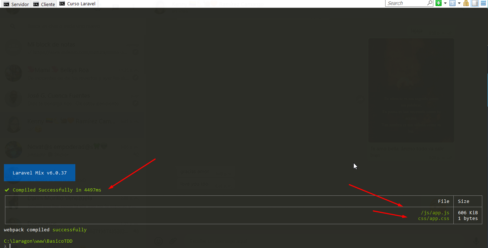

# Curso de Desarrollo en Laravel con Test Driven Development 02/11/2021 

<p align="center"></p>

## Clase 1: Todo lo que aprenderás sobre TDD en Laravel
- Ciclo Desarrollo Una prueba. 
- Deasarrollo un código. 
- Valido si ese código esta bien. 

## Clase 2: Proyecto desarrollado con TDD
- Se muestra lo que vamos a crear 

## Clase 3: Configuración Inicial del proyecto
Ejecutamos los siguiente comandos: Usaremos laravel con **jetstream:install livewire** para este ejemplo 
- Paso 1: `composer create-project --prefer-dist laravel/laravel BasicoTDD` cd  BasicoTDD->nombre del proyecto 
- Paso 2: `composer require laravel/jetstream` 
- Paso 3: `php artisan jetstream:install livewire`
- Paso 4: `npm install && npm run dev`
- Paso 5: Valido si se intalo bien. 



## Clase 4:  Relaciones: múltiples 

Creamos nuestra primera prueba test usando el comando: 
- `php artisan make:test Models/UserTest --unit` 
- Creamos el modelo repositorio `php artisan make:model Repository -mf`

> Nota: Cambiamos la clase debido que Laravel ya utiliza PHPUnit en su sistema de testing, pero además le añade cierta configuración y métodos que hace mucho más óptimo el testeo. Fíjate que hay dos maneras de testear, una es ejecutando vendor/bin/phpunit y la otra es php artisan test. Nosotros utilizamos php artisan test y es por eso que cambiamos la clase, para obtener toda la configuración optimizada que nos provee Laravel. {by Gabriel Rodriguez, Hace 9 Meses}

```
<?php

namespace Tests\Unit\Models;

use App\Models\User;
use Illuminate\Database\Eloquent\Collection;
// use PHPUnit\Framework\TestCase;
use Tests\TestCase;


class UserTest extends TestCase
{
    public function test_has_many_repositorios(){

        $user= new User; 
        Self::assertInstanceOf(Collection::class, $user->repositories);
    }
}

```

## Clase 5: Relaciones: pertenencia

Creamos la segunda prueba del modelo de repositorio. Ejecutando el siguiente comando: 
`php artisan make:test Models/RepositoryTest --unit`

Este test es para generar relaciones entre dos modelos aqui le indicamos que un repository pertenece a un usuario. **belongTo**

```
<?php

namespace Tests\Unit\Models;


use App\Models\User;
use App\Models\Repository;
use Tests\TestCase;

use Illuminate\Foundation\Testing\RefreshDatabase; //Acá agregar este use

class RepositoryTest extends TestCase
{

    use RefreshDatabase;// Esto es para mantener la tabla dinamicamente limpias. 

    public function test_belong_to_user()
    {
        $repository = Repository::factory()->create();
        Self::assertInstanceOf(User::class, $repository->user);

    }
}

```


## Clase 6: Proteger ruta


