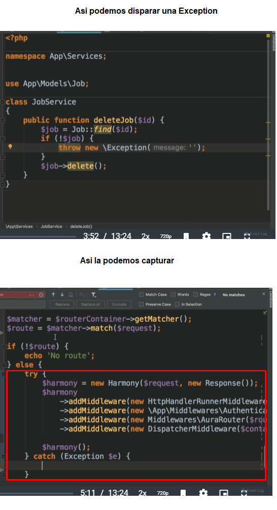
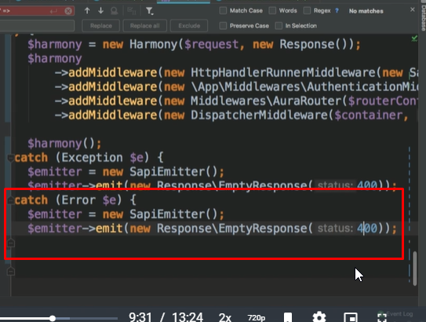
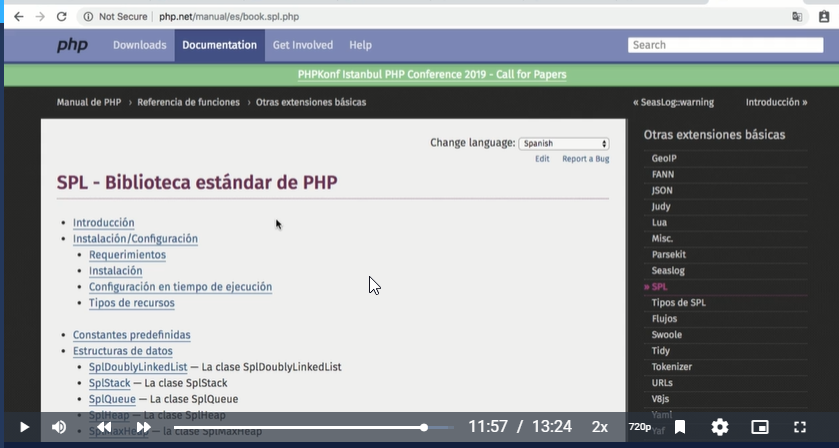

# Curso_avanzado_php

## IDEs

- Durante tu vida como desarrollador, escucharás el término de IDE que significa Entorno de desarrollo integrado. 
- El término de editor de código fuente. 
- La principal diferencia entre estos dos es que un IDE normalmente cuenta con más características como herramientas para administrar bases de datos, controlador de versiones (Git), debug o depuración y al tiempo incluye un editor de código fuente.
- Es importante que sepas que tu IDE será una herramienta que usarás día a día así que debes conocerla muy bien y sentirte cómodo con ella. 
- Explora sus atajos y ventajas frente a otras herramientas.

## Enlace Referencias 
- https://rimorsoft.com/ 


## Virtualización con Vagrant


> Nota: Existen dos vertientes principales: Vagrant y Docker. 
- Vagrant genera máquinas virtuales completas en las cuales podemos instalar PHP, bases de datos, Apache, entre otras. 
- La otra vertiente es Docker con la cual se generan pequeños contenedores dentro de una máquina virtual los cuales contienen la instalación de PHP o la base de datos, logrando que trabajen en conjunto.
- Podemos descargar Vagrant https://www.vagrantup.com/
- Utilizaremos la imagen de Laravel Homestead siguiendo los pasos que aquí se describen: https://laravel.com/docs/5.7/homestead. Las imágenes de Vagrant las llamaremos box o cajas, Homestead es una de ellas.

> Notas para Homestead
- Cuando inicializamos Homestead, lo que hacemos es crear un nuevo archivo de configuración “Homestead.yaml”.
- Al editar el archivo “Homestead.yaml”, tenemos información de la ip que no es el localhost por ser máquina virtual. Aquí igualmente ligamos nuestra carpeta de proyecto a la carpeta de la máquina virtual; también podemos añadir bases de datos y diferentes proyectos dentro de la misma máquina o box.
- Cuando usas el comando “vagrant up” se creará una máquina virtual vagrant si no existe; si existe se reiniciará la máquina existente. Se ejecutará también el aprovisionamiento que es configurar o instalar cualquier cosa que se necesite.

## Enlaces 

- https://www.vagrantup.com/
- https://www.docker.com/
- https://laravel.com/docs/5.7/homestead


> Notas  Problemas al iniciar  

``` 
- Si les genera error al ejecutar init.bat.
- bash: init.bat: command not found]
```

## Datos para configuración 

```
Para los que han tenido problemas de configuracion como yo prueben lo siguiente:

Tienen que tener su llave ssh creada y especificar bien la ruta en Homestead.yaml
Verificar la ruta de folder y site es SUPER IMPORTANTE en Homestead.yaml
Esta fue la configuracion que funciono para mi equipo:

---
ip: "192.168.10.10"
memory: 2048
cpus: 2
provider: virtualbox

authorize: /root/.ssh/id_rsa.pub

keys:
    - /root/.ssh/id_rsa

folders:
    - map: /opt/platzi/phpAvanzado
      to: /home/vagrant/code

sites:
    - map: homestead.test
      to: /home/vagrant/code/public
    - map: cursophp.test
      to: /home/vagrant/code/cursopractica/public

databases:
    - homestead
    - cursophp

``` 

## Configuración de virtual host

- El archivo host sirve para indicarle a nuestra computadora que cierta url está relacionada con cierta ip. Debes modificar este archivo si quieres que al escribir cierta url, el computador entienda una ip dada. En este caso usaremos la ip que tenemos en nuestro archivo “Homestead.yaml” y la url será cursophp.test.
- El comando “vagrant ssh” va a meterte dentro de la máquina virtual que creaste. Esto es bueno porque todo lo que usemos en un equipo de trabajo será estandarizado, todo basado en Linux y con las mismas versiones.
- Homestead ya cuenta con Composer instalado por default, así que podemos traer todas las dependencias de nuestro proyecto con “composer install” una vez que estemos en la carpeta de nuestro proyecto.
- Creamos una conexión ssh para la base de datos y creamos la tabla jobs. Con esto ya funcionará el proyecto del curso pasado, virtualizado.

## Closures 

- Se conocen como funciones anonimas  
- Permiten la creación de funciones que no tienen un nombre específico.
- Pueden ser asignadas a funciones, variables, o usadas como parámetros y valores de retorno
- Las variables pueden contener cualquier tipo de dato como enteros, cadenas y objetos, pero también pueden contener funciones.
- Para usar variables del scope superior en los closures, es necesario usar el “use” y entre paréntesis las variables. 

Ejemplo 

```
$filtro = function ($job) use($maxMount) {
            return $job["months"] > $maxMount;
        };
```


- Podemos usar el map de javascript pero de esta forma en php 
```
$jobs = [
	"edad"=>"12",
	"edad"=>"20",
	"edad"=>"30",
	"edad"=>"40",
	"edad"=>"19",
]; 

$edad_maximas =15; 
#Declaramos nuestra función anonima (use ($edades_maximas)) Como trabjar scope superiores 
$filterFunction = function ($job) use ($edades_maximas) {
	return $job['edad'] >=$edad_maximas;
}

# array_filter es nuestro equivalente a nuestro map en js 
$jobs = array_filter($jobs->toArray(), $filterFunction );


```


## Enlaces 

- https://www.php.net/manual/es/functions.anonymous.php 
- https://www.php.net/manual/es/class.closure.php
- https://github.com/hectorbenitez/curso-introduccion-php/ (Por si deseas decargar el proyecto)


## Type Hinting

> Type Hinting nos permite especificar el tipo de los parámetros que recibe una función y el tipo de los parámetros de retorno de esa función. 
  

- No todas las versiones anteriores de PHP contaban con Type Hinting, esto es sólo desde la 7.1 y superiores, pudiéndose usar para clases, interfaces y tipos escalares.
- Permite especificar el tipo de datos que se espera de un argumento en la declaración de una ** función**. 
- Cuando se llama a la función, PHP comprobará si los argumentos son del tipo especificado, y si no lo son se emitirá un error y la ejecución se detendrá.
- Si ponemos que un valor de entrada debe ser entero pero recibe un arreglo, nos dará error lo cual ayuda a detectar posibles bugs desde el principio. 

**Cuando usarlos:**
- Cuando queremos forzar a una función a aceptar sólo argumentos de un tipo. 
- Su uso más común es con objetos, indicando el nombre de la clase:
- Type Hinting es una característica muy importante de PHP, ayuda a tener un código más limpio, entendible y detecta errores antes de que estos suban a producción.

**Ejemplo **
```
public function postLogin(ServerRequest $request){
```

## Enlaces 

- https://diego.com.es/type-hinting-en-php 

## Traits  (treits)

> Los Traits son pequeños conjuntos de funcionalidad que podemos inyectar en nuestras clases.

- PHP es un lenguaje que usa herencia simple, lo cual significa que una clase solo puede heredar de una clase. 
- Una clase no puede heredar de dos o más clases.
- En momentos específicos queremos compartir cierta parte de código con una clase pero no queremos necesariamente que forme parte de la cadena de herencia. 
- Para esto existen los Traits que están presentes en otros lenguajes como Ruby


Ejemplo 

```
# Esto es para declarar nuestros traits 
# Nombre de este arhivo ejemplo Ruta-> app\Http\Controllers\Traits nombre-> ValidarCsvTrait.php 
<?php


namespace app\Http\Controllers\Traits; // Nuestros namespace 

use App\Models\Cct;                // llamados a Models 
use PhpParser\Node\Stmt\TryCatch;  
use Illuminate\Support\Facades\DB;
use Illuminate\Support\Facades\Log;


trait MetodoDOMTrait {

    function procesarDOM ( $nombreArchivoCsv, $pakage_id ) {
			//... 
			//... 
			// Bloque Codigo 
        
    }

}

trait MetodoCCTTrait {
    function procesarCCT ( $nombreArchivoCsv, $pakage_id ) {
			//... 
			//... 
			// Bloque Codigo 

	}


# Esto es para implementarlo 

#Paso 1 : Debemos importarlo 
use App\Http\Controllers\Traits\ValidarCsvTrait;

# Paso 2: Importamos sus metodos 

use App\Http\Controllers\Traits\MetodoDOMTrait;

# Paso 3: Lo Instanciamos en la clase que queremos usar 

class PackageController extends Controller
{
    //Métodos de validación
    use ValidarCsvTrait;
    use MetodoDOMTrait
	
	
# Paso 4: Asi llamamos los metodos declarados en los traits luego de importarlos e instaciarlos	

self::metodoPackageTrait($nombreCsv, $valCsv['tipo'], $pakage_id); 
ó 
PackageController.metodoPackageTrait($nombreCsv, $valCsv['tipo'], $pakage_id); 

```


## Compact  

> Existe una función de PHP que se llama compact a la cual si le pasas los nombres, buscará las variables y las meterá en un arreglo.
> Por cada variable, compact() busca una variable con ese nombre en la tabla de símbolos actual y las añade al array de salida de modo que el nombre de la variable se convierte en la clave y el contenido de la variable se convierte en el valor para esa clave.

## Enlace 
- https://www.php.net/manual/es/function.compact.php 

## Third party Traits - Soft Delete

- Soft Delete es una técnica de programación en la cual no borramos realmente los registros en la base de datos sino que únicamente los marcamos como borrados para que ya no sean mostrados en nuestras vistas o en las consultas de usuarios. Al implementar un soft delete tendrás que usar algo en tu base de datos que te permita definir que estás trabajando con soft deletes. Podrías usar una bandera o un datetime que te marque la fecha en la que fue borrado.

- Como un soft delete no borra físicamente, podemos igualmente consultar esta información.


Se debe especificar en laravel que se usara el Soft Delete: 
- Por lo general esto se especifica en el modelo. 
- Se debe importar la libreria en el modelo ***use Illuminate\Database\Eloquent\SoftDeletes***
- En la parte interna de la clase anexamos el uso, ** use SoftDeletes **
- Debemos anexarlo a nuestro migrate ** $table->softDeletes();**

- withTrashed es un método que modificará la consulta para que traiga los registros borrados con soft delete.
`$job = Job::withTrashed()->where('id', $params['id'])->restore();`

## SOLID 

> SOLID nos habla de 5 principios básicos de la programación orientada a objetos. Estos 5 principios ayudan a tener un código más claro y más limpio aunque no son fáciles de implementar en un principio. La recomendación es que sigas intentando hacerlo, que sigas leyendo, entrenando y preparándote y todo va a ir saliendo de manera natural.


- Single responsibility principle o principio de responsabilidad única. Quiere decir que cuando crees una clase, ésta sólo debe tener un propósito que debe ser sencillo; el no hacerlo hace que nuestro código se pueda ver afectado ya que una sola cosa controla muchas otras.
- Open-closed principle o principio “abierto-cerrado”. Trata de explicarnos que deberíamos programar nuestras clases pensando que sean abiertas a la extensión pero cerradas a la modificación. Debemos tratar que nuestras clases estén listas para ser heredadas o extendidas pero no deba ser necesario modificar el código interno.
- Liskov substitution principle o principio de sustitución de Liskov. Nos dice que cuando tenemos una clase padre y creamos clases hijas, en las partes en las que usemos nuestra clase padre, deberíamos ser capaces de usar nuestras clases hijas. Las clases hijas deben poder funcionar con lo que funcionaba la clase padre.
- Interface segregation principle o segregación de interfaces. Dice que no debemos implementar o tener interfaces que incluyan métodos o cosas que la clase no necesita.
- Dependency inversion principle o inversión de dependencias. Trata de desacoplar nuestro código; en lugar de crear clases internamente, vamos a inyectarlas o agregarlas. La inyección de dependencias se usa mucho.

## Inyección de dependencias

> El concepto de inyección de dependencias lo encontrarás en muchos frameworks de programación como Symfony o Laravel y es importante que entiendas cómo funciona.

- Tener mucho código dentro de los controladores es malo porque si lo quisiéramos reutilizar, tendríamos que duplicarlo lo cual es muy tedioso en proyectos grandes y abre posibilidades a errores y vulnerabilidades. La mejor práctica es no tener duplicidad en el código.
- El principio de control de inversión dice que debemos invertir el control y no tenerlo dentro de nuestra clase sino afuera.
- Al estar inyectando, si nuestra clase extiende de otra clase base hay que tener cuidado de usar el constructor base con parent::__construct();
- Para inyectar el argumento que se necesita dentro del controlador debemos usar un contenedor de inyección de dependencias el cual es una clase que se encarga de elegir las dependencias correctas en las clases instanciadas.

## Los middleware 

> Un middleware es un software que proporciona un enlace entre aplicaciones, sistemas o proyectos independientes. En otras palabras es un elemento que usamos como la vía para conectar dos aplicaciones o dos partes, su función es pasar datos entre ellas o de un lado a otro.

> Los middleware proporcionan un mecanismo conveniente para filtrar solicitudes HTTP entrantes a tu aplicación. Por ejemplo, Laravel incluye un middleware que verifica si el usuario de tu aplicación está autenticado. ... Los middleware adicionales pueden ser escritos para realizar una variedad de tareas además de autenticar.

- Están siendo muy utilizados no solamente en PHP sino en otros lenguajes. 
- PHP tiene definido un PSR (PSR 15) con una interfaz común para trabajar los middleware.
- Debes acostumbrarte a leer código de otras personas o librerías. Detrás de todo hay un programador haciendo algo que podrás entender y modificar.
- Es muy importante que leas los errores ya que muchas veces te dará pistas muy buenas de lo que está sucediendo.
- La autenticación la manejaremos a través de un middleware.
- Para crear nuestro middleware y como estamos trabajando con PSR-15, utilizaremos la interfaz que nos provee PSR-15 lo cual genera un contrato entre las clases que usamos y las clases que usan otras librerías. Así aseguramos interoperabilidad entre aplicaciones.
- Los status 200 son status correctos.
- Los status 400 estamos enviando algún error culpando al usuario.
- Los status 500 son errores en nuestro servidor.
- Un middleware tiene la parte del handler pero puede hacer cosas antes o después.

## Como funciona 
> Funcionan de la siguiente manera: Tenemos muchas capas encerrando nuestra aplicación, 
las cuales serán filtros que le darán funcionalidad y así un request que entre no deberá 
entrar al core de la aplicación y se obtendrá una respuesta si no pasa los filtros. 
Estos middleware pueden ser autenticaciones, revisiones de permisos, llamadas y conceptos de ese estilo.

## Error Handling 

- Podemos controlar la excepción con error handling enviando respuestas más profesionales de los errores que se puedan presentar.
- En vez de respuestas vacías en el emitter, se puede enviar un HTML mostrando imágenes o cosas custom.
- La diferencia entre las excepciones y los errores es que las excepciones normalmente son disparadas por el programador y los errores son cosas que PHP detecta que no pueden ser realizadas. En PHP 5 y anteriores no había manera de manejar eso pero a partir de PHP 7 podemos agarrar y manejar los errores del código.
- Error y excepción no forman parte de una cadena de herencia, funcionan porque implementan la interfaz Throwable la cual nunca debe ser implementada.
- Podemos tener un try y muchos catch dependiendo de los diferentes casos que tengamos.
- SPL es la biblioteca estándar de PHP y aquí podemos encontrar estructuras e interfaces muy interesantes. También tenemos las excepciones.
- Laravel Eloquent tiene un método de findOrFail que si no encuentra un objeto, inmediatamente nos tira una excepción.

Ejemplo Try en Middleware 



- Ya Php 7 en adelante podemos Capturar nuestros errores 



Ya contamos con Librerias que podemos especificar que tipo exception podemos manejar 

##Excepciones
- BadFunctionCallException — La clase BadFunctionCallException
- BadMethodCallException — La clase BadMethodCallException
- DomainException — La clase DomainException
- InvalidArgumentException — La clase InvalidArgumentException
- LengthException — La clase LengthException
- LogicException — La clase LogicException
- OutOfBoundsException — La clase OutOfBoundsException
- OutOfRangeException — La clase OutOfRangeException
- OverflowException — La clase OverflowException
- RangeException — La clase RangeException
- RuntimeException — La clase RuntimeException
- UnderflowException — La clase UnderflowException
- UnexpectedValueException — La clase UnexpectedValueException


## La biblioteca SPL (Standard PHP Library) 

> Son las librerias de php donde podemos usar e implementar claro unas que otras habra que descargarla o habilitarla en el php.ini

- https://www.php.net/manual/es/book.spl.php
- SPL_PHP_.png



>Ees un conjunto de Clases e Interfaces para PHP que fue diseñada para ayudarnos con nuestras aplicaciones. 
- SPL se distribuye directamente con PHP desde su versión 5.0 y aunque no es obligatorio usarla, el aprender de ella te permitirá tener un mejor código, más robusto y también más orientado a objetos.
- Uno de los puntos más usados en el pasado fue la función spl_autoload_register que nos permitía indicar a nuestro código la forma en la que haríamos el autocargado de clases, obviamente esto ya no es tan usado (al menos ya no lo hacemos de forma manual) debido a que podemos solucionar el problema usando composer, pero en su momento fue una herramienta muy popular y usada dentro de las aplicaciones PHP.
- Además de spl_autoload_register, SPL nos ofrece otras herramientas muy interesantes para nuestro código:

## Iteradores

- Los iteradores sirven para recorrer conjuntos de elementos. Un iterador es un objeto que sirve para recorrer algo. En esta area SPL nos ofrece muchas clases nuevas que mejoran drásticamente la forma en la que escribimos código, entre las clases más populares nos encontramos con ArrayIterator que sirve para recorrer arreglos optimizando la memoria usada por el sistema y DirectoryIterator que nos permite recorrer los archivos y las carpetas de una ubicación.
- En caso de que ninguna clase cumpla con lo que queremos hacer, SPL también nos ofrece ciertas interfaces que nos permitirán mejorar la forma en la que usaremos nuestros objetos, por ejemplo podemos implementar la Interfaz Iterator si queremos que nuestro objeto pueda ser iterado o podemos implementar la interfaz ArrayAccess si queremos usar la sintaxis de acceso a elementos tipo arreglo en nuestros objetos, por ejemplo $object[0].

## Estructuras de Datos
- Los arrays dentro de PHP son muy versátiles, sin embargo es verdad que no solucionan todas las funciones que a veces necesitamos, en lugar de que intentemos forzar la forma en la que usamos los arrays, una buena idea siempre será echar un ojo a las estructuras que SPL nos ofrece.
- Entre las estructuras más usadas dentro de SPL podemos encontrar listas, pilas y colas, las cuales sin lugar a dudas darán mucha más claridad a lo que estamos intentando resolver dentro de nuestra aplicación.

## Excepciones
- A la hora de enviar excepciones para indicar que ocurrió un error, la forma más sencilla de hacerlo es utilizando la clase Exception, sin embargo SPL nos ofrece una variedad mayor de excepciones, las cuales podemos aprovechar para tener un mejor control de los errores que ocurren en nuestra app.
- Por ejemplo LogicException y sus derivadas indican que se encontró un error que probablemente es culpa de nosotros como programadores, algo estamos haciendo mal y debemos tratar de evitar que esto llegue a producción.
- Por otro lado RuntimeException y sus derivadas nos indican que algo pasó y no teníamos control de eso durante el desarrollo, por ejemplo una conexión interrumpida a la base de datos o algún archivo al que no podemos acceder, y aunque esto podría pasar en producción, el controlar bien las excepciones nos permitirá al menos tener una falla más amigable y no mostrar al usuario una horrible pantalla con datos de nuestro código.
- Algo que también puedes hacer es extender de estas clases y crear tus propias excepciones, de este modo podrás tener aun más información acerca de los que pasa en tu proyecto.
- Siempre trata de enviar la excepción que más claramente indique lo que sucedió, esto no hará tu control de errores más sencillo, pero sí te ayudará a entender las causas de los errores que aparecen en tu código.


- chrome://settings/cookies