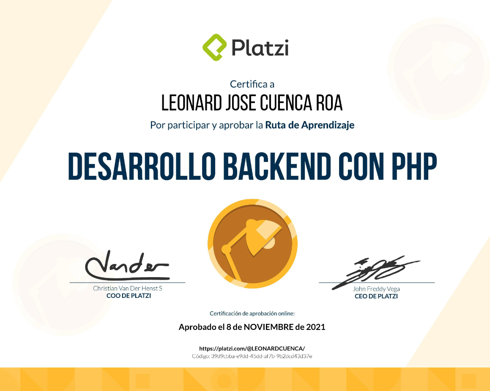
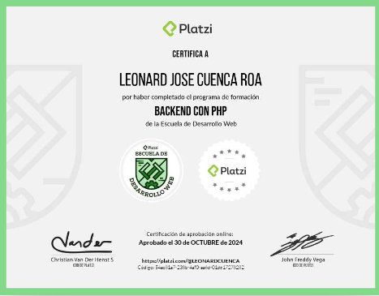

# PHP Backend Web Development

```Part of my initiative to improve my learning and professional growth, take Leonard to the LeoSan Professional Version 4.0 All About PHP provided by the Platzi educational platform, unlearn to improve, we know that technologies advance all the time and it is best to resume the foundations and reflect on them to create new foundations.```

> Learning about PHP - Basic 

- 🎓 Course  Introducción PHP Composer - [See Certificate](https://github.com/LeoSan/DesarrolloWebBackendPHP_PLATZI_2021/blob/main/01_Basico/00_Curso_Introducci%C3%B3nPHPComposer/Examen/2021_Diploma-php_composer_platzi.pdf)
- 🎓 Course  Manejo Datos PHP - [See Certificate](https://github.com/LeoSan/DesarrolloWebBackendPHP_PLATZI_2021/blob/main/01_Basico/01_CursoManejoDatosPHP/Examen/2021_Diploma-datos-php_2021.pdf)
- 🎓 Course  Programación Orientada Objetos PHP [See Certificate](https://github.com/LeoSan/DesarrolloWebBackendPHP_PLATZI_2021/blob/main/01_Basico/02_Curso_ProgramacionOrientadaObjetosPHP/Examen/2021_Diploma-php-poo_PLATZI.pdf)
- 🎓 Course  Introduccion Frameworks_PHP [See Certificate](https://github.com/LeoSan/DesarrolloWebBackendPHP_PLATZI_2021/blob/main/01_Basico/03_Curso_Introduccion_Frameworks_PHP/Examen/2021_Diploma-php-frameworks_PLATZI.pdf)
- 🎓 Course  Desarrollo Backend [See Certificate](https://github.com/LeoSan/DesarrolloWebBackendPHP_PLATZI_2021/blob/main/01_Basico/04_CursoIntroduccionDesarrolloBackend/Examen/2021_Diploma-introduccion-backend_PLATZI.pdf)


> Learning about PHP - Medio 

- 🎓 Course  Introduccion Laravel - [See Certificate](https://github.com/LeoSan/DesarrolloWebBackendPHP_PLATZI_2021/blob/main/02_Intermedio/01_Curso_Introduccion_Laravel/Examen/Diploma-intro-laravel-2020.pdf)
- 🎓 Course  Básico Manejo Datos Laravel Eloquent ORM - [See Certificate](https://github.com/LeoSan/DesarrolloWebBackendPHP_PLATZI_2021/blob/main/02_Intermedio/02_CursoBasicoManejoDatosLaravelEloquentORM/Examen/2021_Diploma-eloquent-laravel.pdf)
- 🎓 Course  Introduccion Laravel 8 - [See Certificate](https://github.com/LeoSan/DesarrolloWebBackendPHP_PLATZI_2021/blob/main/02_Intermedio/03_Curso_Introduccion_Laravel_8/Examen/2021_Diploma-intro-laravel-platzi.pdf)

> Learning about PHP - Avance
- 🎓 Course RenovadoPHP - [See Certificate](https://github.com/LeoSan/DesarrolloWebBackendPHP_PLATZI_2021/03_Avanzado/12_Curso_Renovado_PHP_2024/2024_diploma-web-php_platzi.pdf)
- 🎓 Course  API REST - [See Certificate](https://github.com/LeoSan/DesarrolloWebBackendPHP_PLATZI_2021/blob/main/03_Avanzado/01_CursoAPI_REST/Examen/2021_Diploma-api-rest_PLATZI.pdf)
- 🎓 Course  API REST Laravel - [See Certificate](https://github.com/LeoSan/DesarrolloWebBackendPHP_PLATZI_2021/blob/main/03_Avanzado/02_CursoAPI_REST_Laravel/Examen/2021_diploma-laravel-api-Platzi.pdf)
- 🎓 Course  Laravel 8 Avanzado - [See Certificate](https://github.com/LeoSan/DesarrolloWebBackendPHP_PLATZI_2021/blob/main/03_Avanzado/03_Laravel_8_Avanzado/Examen/2021_Diploma-laravel-avanzado_PLATZI.pdf)
- 🎓 Course  Introducción Despliegue Aplicaciones - [See Certificate](https://github.com/LeoSan/DesarrolloWebBackendPHP_PLATZI_2021/blob/main/03_Avanzado/04_%20Curso_IntroduccionDespliegueAplicaciones/Examen/2021_Diploma-despliegue-apps_PLATZI.pdf)
- 🎓 Course  Desarrollo Laravel Test Driven Development - [See Certificate](https://github.com/LeoSan/DesarrolloWebBackendPHP_PLATZI_2021/blob/main/03_Avanzado/05_Curso_DesarrolloLaravelTestDrivenDevelopment/Examen/2021_Diploma-laravel-tdd_PLATZI.pdf)
- 🎓 Course  PHP Laravel - [See Certificate](https://github.com/LeoSan/DesarrolloWebBackendPHP_PLATZI_2021/blob/main/03_Avanzado/08_Curso_PHPLaravel/Examen/2021_Diploma-curso-php-laravel-platzi.pdf)
- 🎓 Course  Avanzado PHP - [See Certificate](https://github.com/LeoSan/DesarrolloWebBackendPHP_PLATZI_2021/blob/main/03_Avanzado/10_CursoAvanzadoPHP/Examen/2021_Diploma-php-avanzado_PLATZI.pdf)


> Final Certificate Global 




- 🎓 Certificado de la Carrera Platzi - [See Certificate](https://github.com/LeoSan/DesarrolloWebBackendPHP_PLATZI_2021/blob/main/2021_Diploma-Carrera-backend_php_PLATZI.pdf)


> Project Certificate -  still in development
```As a personal goal and renewal of all my curricular synthesis, I am raising a manager of skills and experience in multilanguage, to be able to show everything in an easy to administer and configure tool.```

